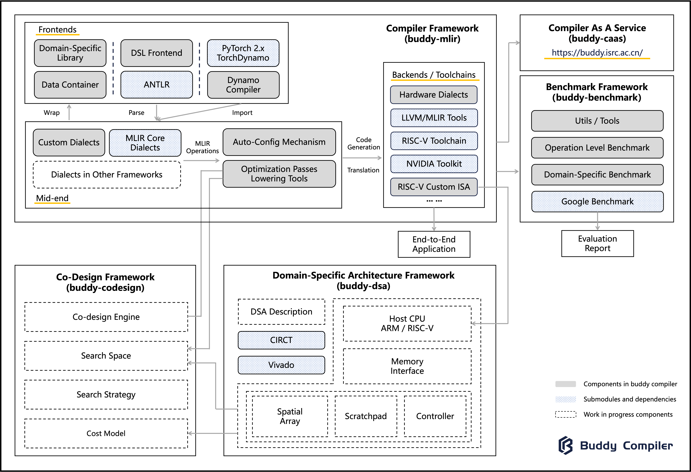

# Buddy Compiler

The buddy compiler is a domain-specific compiler infrastructure. We use "buddy" as the name because our infrastructure intends to be the buddy system to help users easily design, implement, and evaluate domain-specific compilers.
The buddy compiler community welcomes any ideas. Join us through this [slack link](https://join.slack.com/t/buddycompiler/shared_invite/zt-13y6ibj4j-n6MQ8u9yCUPltCCDhLEmXg) if you want to contribute.

[View it on GitHub](https://github.com/buddy-compiler){: .btn .btn-primary .fs-5 .mb-4 .mb-md-0 .mr-2 }

[Projects](https://buddycompiler.notion.site/7f92ee739453461d956b5b4e4bb73bf1?v=70f2180e94ce4f7fa5bac01f4b47b98e&pvs=4){: .btn .btn-primary .fs-5 .mb-4 .mb-md-0 .mr-2 }

## Motivation

With the development of domain-specific architectures and languages, the need for compilers has grown, and the research of compiler technology has reached a golden age. Implementing an end-to-end compiler from scratch for a new DSA or DSL is difficult. Our goal is to provide a framework to help users quickly implement a domain-specific compiler, including DSL frontend support, IR-level optimization, and DSA backend code generation. 

MLIR is a revolutionary multi-level intermediate representation and compiler infrastructure that provides reusable and extensible mechanisms. RISC-V is open-sourced instruction set architecture with a modular design, allowing custom extensions. MLIR and RISC-V have extensible concepts for domain-specific design and maximize the reuse of base parts. We thus particularly embrace the MLIR and RISC-V ecosystems for our framework and believe MLIR is a perfect companion for compiler development towards the RISC-V backend. As for the DSL frontend support, we do not have a clear plan and looking forward to more discussion.

Our work is still in the very early stages, and we are currently exploring IR-level optimization and building infrastructures. For more information, please see our [documents](https://github.com/buddy-compiler/buddy-mlir/tree/main/docs) and [open projects](./Pages/OpenProjects.md).

## Overview

Currently, the buddy compiler contains the following two modules:

- buddy-mlir (get started from [here](https://github.com/buddy-compiler/buddy-mlir))

The buddy-mlir is the MLIR-based domain-specific compiler framework. We use MLIR as the cornerstone and explore how to build a domain-specific compiler on top of it. Our research in this framework includes domain-specific IR and optimization, domain-specific compiler frontend and backend implementation, MLIR-related development tools, etc.

- buddy-benchmark (get started from [here](https://github.com/buddy-compiler/buddy-benchmark))

The buddy-benchmark is a benchmark framework to evaluate domain-specific compilers and libraries. Evaluation is an essential step in developing a compiler. We can hardly find a unified benchmark to evaluate compiler or optimization in some domains. We thus propose an extensible benchmark framework to collect domain-specific evaluation cases.

The graph below shows the modules of the buddy compiler.

## Next Steps

If you are interested in our project, you can play around with examples in [buddy-mlir](https://github.com/buddy-compiler/buddy-mlir) and [buddy-benchmark](https://github.com/buddy-compiler/buddy-benchmark). Then you can see if there are [projects in the list](./Pages/OpenProjects.md) that appeal to you; feel free to contact us via [slack](https://join.slack.com/t/buddycompiler/shared_invite/zt-13y6ibj4j-n6MQ8u9yCUPltCCDhLEmXg) for more details. We also provide a [contributor guide](./Pages/ContributorGuide.md) for you if you want to contribute your code.
