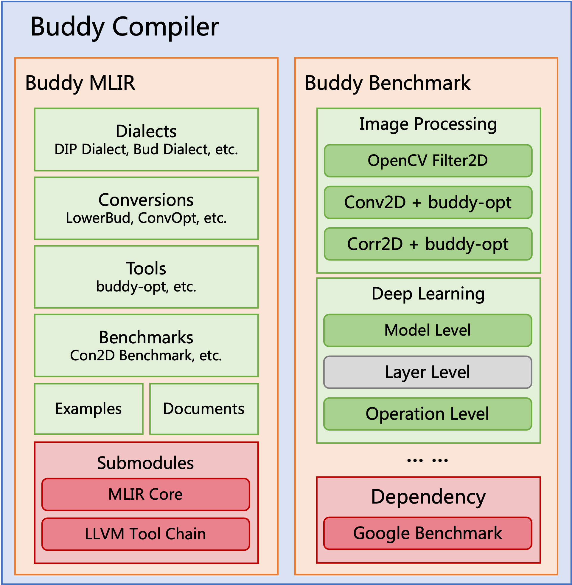

## Framework Overview

As shown in following figure, the framework has open sourced two modules. One is the compiler framework to develop the compiler tool-chain, and the other is the benchmark framework to evaluate the performance. Our
approach is implemented in the compiler framework and evaluated in the benchmark framework.

In the compiler framework, we integrate the LLVM project to reuse the MLIR infrastructure and LLVM backend tools. Based on the MLIR optimization driver, we implement our optimization tool to make our work benefit the MLIR ecosystem. We have also designed an auto-config mechanism to ensure that the algorithm executes on different SIMD machines efficiently. 

To implement an optimization approach in the compiler framework :
 - We need to implement our algorithm as a pattern, define a pass to trigger the rewrite process, and register the pass into the optimization tool. 
 - The optimization tool will expose configurable items of the algorithm to auto-config mechanism. 
 - We also need to design a configuration rule and register it into the auto-config tool. The auto-config mechanism will detect the target hardware and provide configuration according to the registered rule, this will guide the code generation process of the optimization tool. 
 - To ensure re-usability, our tools are fully compatible with upstream MLIR. 
 - Apart from that, we have also added a domain-specific extension (for image processing) of our method by defining a new MLIR dialect and registering it into the optimization tool. 
 - The code generated from our optimization tool can be used for both just-in-time (JIT) execution and ahead-of-time (AOT) compilation.

In the benchmark framework, we have integrated the google benchmark infrastructure in backend and 
have provided an extensible mechanism for adding different operations and applications in it. The 
benchmark framework can interoperate with the compiler framework to evaluate the code generated from 
the compiler toolchain. It compiles the compiler framework code as a library and links it with benchmark cases. After building on the target machine, we can run these benchmark cases to obtain the required performance information.

Further information about our developed optimizations can be found in [this](https://github.com/buddy-compiler/buddy-mlir/tree/main/docs) folder.
