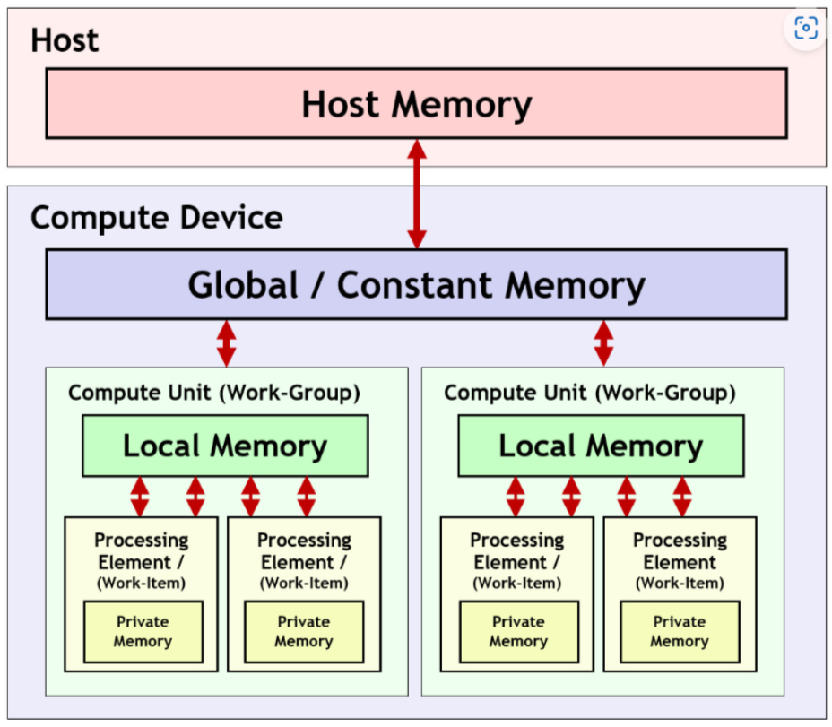

# GPUCompilerStack

This article will introduce in detail the GPU compilation stack of the mainstream deep learning compilers.

## MLIR

We will give a detailed introduction to the passes needed to lower to gpu mlir in MLIR in this part.

### `-gpu-kernel-outlining`

The pass -gpu-kernel-outlining is an MLIR pass for optimizing GPU kernel functions, which can unfold the loops in GPU kernel functions into multiple loops, thereby improving the execution efficiency and readability of GPU kernel functions.

This pass can effectively reduce unnecessary or redundant operations in GPU kernel functions, and improve the call frequency between different sub-functions in GPU kernel functions. This can improve the performance of GPU kernel functions when running on different types and sizes of GPUs.

The pass can be created by `createGpuKernelOutliningPass()`(This code can by located in `lib/Dialect/GPU/Transforms/KernelOutlining.cpp`). 

```c++
std::unique_ptr<OperationPass<ModuleOp>>
mlir::createGpuKernelOutliningPass(StringRef dataLayoutStr) {
  return std::make_unique<GpuKernelOutliningPass>(dataLayoutStr);
}

class GpuKernelOutliningPass
    : public impl::GpuKernelOutliningBase<GpuKernelOutliningPass> {
public:
  GpuKernelOutliningPass(StringRef dlStr) {
    if (!dlStr.empty() && !dataLayoutStr.hasValue())
      dataLayoutStr = dlStr.str();
  }

  GpuKernelOutliningPass(const GpuKernelOutliningPass &other)
      : GpuKernelOutliningBase(other), dataLayoutSpec(other.dataLayoutSpec) {
    dataLayoutStr = other.dataLayoutStr.getValue();
  }

  LogicalResult initialize(MLIRContext *context) override {
    if (!dataLayoutStr.empty()) {
      Attribute resultAttr = mlir::parseAttribute(dataLayoutStr, context);
      if (!resultAttr)
        return failure();

      dataLayoutSpec = dyn_cast<DataLayoutSpecInterface>(resultAttr);
      if (!dataLayoutSpec)
        return failure();
    }

    return success();
  }

  void runOnOperation() override {
    SymbolTable symbolTable(getOperation());
    bool modified = false;
    for (auto func : getOperation().getOps<SymbolOpInterface>()) {
      Block::iterator insertPt(func->getNextNode());
      auto funcWalkResult = func.walk([&](gpu::LaunchOp op) {
        SetVector<Value> operands;
        std::string kernelFnName =
            Twine(op->getParentOfType<SymbolOpInterface>().getName(), "_kernel")
                .str();

        gpu::GPUFuncOp outlinedFunc =
            outlineKernelFuncImpl(op, kernelFnName, operands);

        auto kernelModule = createKernelModule(outlinedFunc, symbolTable);
        symbolTable.insert(kernelModule, insertPt);

        convertToLaunchFuncOp(op, outlinedFunc, operands.getArrayRef());
        modified = true;
        return WalkResult::advance();
      });
      if (funcWalkResult.wasInterrupted())
        return signalPassFailure();
    }

    if (modified)
      getOperation()->setAttr(gpu::GPUDialect::getContainerModuleAttrName(),
                              UnitAttr::get(&getContext()));
  }

private:
  gpu::GPUModuleOp createKernelModule(gpu::GPUFuncOp kernelFunc,
                                      const SymbolTable &parentSymbolTable) {
    auto *context = getOperation().getContext();
    OpBuilder builder(context);
    auto kernelModule = builder.create<gpu::GPUModuleOp>(kernelFunc.getLoc(),
                                                         kernelFunc.getName());

    if (dataLayoutSpec)
      kernelModule->setAttr(DLTIDialect::kDataLayoutAttrName, dataLayoutSpec);

    SymbolTable symbolTable(kernelModule);
    symbolTable.insert(kernelFunc);

    SmallVector<Operation *, 8> symbolDefWorklist = {kernelFunc};
    while (!symbolDefWorklist.empty()) {
      if (std::optional<SymbolTable::UseRange> symbolUses =
              SymbolTable::getSymbolUses(symbolDefWorklist.pop_back_val())) {
        for (SymbolTable::SymbolUse symbolUse : *symbolUses) {
          StringRef symbolName =
              cast<FlatSymbolRefAttr>(symbolUse.getSymbolRef()).getValue();
          if (symbolTable.lookup(symbolName))
            continue;

          Operation *symbolDefClone =
              parentSymbolTable.lookup(symbolName)->clone();
          symbolDefWorklist.push_back(symbolDefClone);
          symbolTable.insert(symbolDefClone);
        }
      }
    }

    return kernelModule;
  }

  Option<std::string> dataLayoutStr{
      *this, "data-layout-str",
      llvm::cl::desc("String containing the data layout specification to be "
                     "attached to the GPU kernel module")};

  DataLayoutSpecInterface dataLayoutSpec;
};

```

The implementation details of the above code are as follows: 


1. Invoke `getOperation()` to obtain all the Operations in the current context,
2. Then traverse these ops, and create the corresponding `GPUFuncOp` according to the current op using the lambda expression `funcWalkResult`.
3. `funcWalkResult` will generate the kernelName that corresponds to the current op. The `outlineKernelFuncImpl` will create the relevant `GPUFuncOp` (like `gpu.func @matmul_kernel`) based on the kernelName and op.
4. `outlineKernelFuncImpl` will create the suitable `OpBuilder` according to the op's context, `OpBuilder` will create the relevant `gpu.func` according to the parameter type, and set the proper block and grid size. Then it will map the original op's attributes, parameters and region to the suitable position of the created gpu.func.
5. Invoke createKernelModule, this method will create the relevant gpu.module according to the `GPUFuncOp` (like `gpu.module @matmul_kernel`)
6. Invoke `convertToLaunchFuncOp` to produce the relevant `gpu.launch_func`.

### `-gpu-map-parallel-loops`

`-gpu-map-parallel-loops` driver for implementing parallel loop optimization on the GPU. It can convert a loop into multiple parallel loops and select an appropriate parallelization strategy (such as number of threads, inter-thread communication or data allocation) based on different goals (such as performance, power consumption or memory usage). 

The implementation of this pass is in `lib/Dialect/GPU/Transforms/ParallelLoopMapper.cpp`. When using it, call the `createGpuMapParallelLoopsPass()` function to create the pass. This function will return a `GpuMapParallelLoopsPass` structure.

```c++
std::unique_ptr<mlir::OperationPass<mlir::func::FuncOp>>
mlir::createGpuMapParallelLoopsPass() {
  return std::make_unique<gpu::GpuMapParallelLoopsPass>();
}

struct GpuMapParallelLoopsPass
    : public impl::GpuMapParallelLoopsPassBase<GpuMapParallelLoopsPass> {
  void runOnOperation() override {
    for (Region &region : getOperation()->getRegions()) {
      region.walk([](ParallelOp parallelOp) { mapParallelOp(parallelOp); });
    }
  }
};
```

This method will traverse all regions and execute mapParallelOp on the walker of each region.Enumeration class `MappingLevel`, representing three mapping levels: `Grid`, `Block`, `Sequential`.

```c++
enum MappingLevel { MapGrid = 0, MapBlock = 1, Sequential = 2 };
```

Each mapping level is divided into three levels: x, y, and z according to the input dimensions.
`mapParallelOp` maps parallel loops to corresponding workgroups. The default MappingLevel of `mapParallelOp` is `Grid`. The first cycle encountered is mapped to the `Grid level`, the second cycle encountered is mapped to the `Block level`, and so on.

### `-convert-parallel-loops-to-gpu`

This pass is to convert `scf.parallel` to `gpu.launch` operation.This pass is implemented by `createParallelLoopToGpuPass()` (the code is located in `lib/Conversion/SCFToGPU/SCFToGPUPass.cpp`).


```c++
std::unique_ptr<Pass> mlir::createParallelLoopToGpuPass() {
  return std::make_unique<ParallelLoopToGpuPass>();
}
```


In `ParallelLoopToGpuPass`, the `scf.parallel` to `gpu.launch` operation is mainly implemented through the `matchAndReWrite` method of `ParallelToGpuLaunchLowering`. The main idea of this method:

1. Check whether the operation has a parent operation of type `ParallelOp`. If so, it means that the operation is not the outermost loop, then a failure value is returned because it is not supported to initiate a GPU kernel inside a parallel loop.

2. Created a `gpu::LaunchOp` operation, which is a class that represents an operation that launches a GPU core on the specified grid and thread block. It uses a constant 1 as the size of all grids and thread blocks, and these sizes will be adjusted later according to the mapping relationship. A single region containing the kernel body is also created, and a `gpu::TerminatorOp` operation is inserted at the end of the region, which is a class that represents the termination operation of a GPU kernel. It then sets the insertion point to the beginning of the range.

3. An `IRMapping` object is created, which represents a mapping from operations and values to operations and values, which is used to maintain consistency during cloning operations. An `llvm::DenseMap` object is created, representing a mapping from `gpu::Processor` to Value to store the grid and thread block sizes.

4. Call `processParallelLoop` to process a `ParallelOp` operation and convert it into a `gpu::LaunchOp` operation, while updating the mapping relationship, work list, grid and thread block size.

5. Use a loop to iterate through the work list until the work list is empty. In each loop, it does the following:

    a. It pops an operation from the work list and handles it differently depending on the type of operation.
   
    b. If the operation is a `ParallelOp` type operation, which means the operation is a nested parallel loop, then do the following:

      ⅰ. Before entering a nested scope, check whether there have been any side effects. If so, return a failure value because nested parallel loops in code with side effects are not supported.

      ⅱ. Call the `processParallelLoop` function to process this nested parallel loop and update the mapping relationship, work list, grid and thread block size. If this function returns a failure value, then a failure value is returned.

      ⅲ. If the operation is a `gpu::LaunchOp` type operation, it means that the operation is a previously created launch operation. It serves as a sentinel value to indicate that a nested level operation has been completed, then do the following:

      ⅳ. Get the parent operation of the current insertion point, and set the insertion point behind the parent operation, so that you can continue to process the operation of the previous level.

      ⅴ. Set the variable leaving the nested scope to true, indicating that it is no longer in the innermost scope.

      vi. Set the variable that sees the side effect to false, indicating that the status of the side effect is reset.

    c. Otherwise, it means that the operation is a common operation, then do the following:

      ⅰ. Use the rewriter and mapping relationship to clone this operation, and map the result of the operation to the cloned result so that consistency can be maintained.

      ⅱ. Check whether the cloning operation has side effects or whether there are areas. If so, set the variable that sees the side effect to true, indicating that we need to pay attention to the impact of the side effect.

      iii. If the innermost scope has been left and a side effect is seen, a failure value is returned, since side effects in non-innermost scopes are not supported.

6. After the loop ends, it means that the startup operation has been successfully created, then do the following:

    a. Traverse the mapping of grid and thread block sizes, obtain the number of the operand of the startup operation according to the mapped key (value of `gpu::Processor type`), and then set the operand of the startup operation to the mapped value (Value type value) so that the grid and thread block size of the initiated operation can be updated.

    b. Use the rewriter to remove the original parallel loop operation since it has been converted to a startup operation.

### `-convert-gpu-to-nvvm`

Use `-convert-gpu-to-nvvm` pass to convert gpu dialect to nvvm dialect. Through the conversion of this pass, the final llvm ir can run on the NVIDIA GPU. In mlir, this pass is implemented through `struct LowerGpuOpsToNVVMOpsPass` (the code is located at: `lib/Conversion/GPUToNVVM/LowerGpuOpsToNVVMOps.cpp`).

This pass will replace all GPU device operations that occur with corresponding nvvm operations. This pass will only process device code!

```c++
struct LowerGpuOpsToNVVMOpsPass
    : public impl::ConvertGpuOpsToNVVMOpsBase<LowerGpuOpsToNVVMOpsPass> {
  using Base::Base;

  void runOnOperation() override {
    gpu::GPUModuleOp m = getOperation();

    for (auto func : m.getOps<func::FuncOp>()) {
      func->setAttr(LLVM::LLVMDialect::getEmitCWrapperAttrName(),
                    UnitAttr::get(&getContext()));
    }
    LowerToLLVMOptions options(
        m.getContext(),
        DataLayout(cast<DataLayoutOpInterface>(m.getOperation())));
    if (indexBitwidth != kDeriveIndexBitwidthFromDataLayout)
      options.overrideIndexBitwidth(indexBitwidth);
    options.useBarePtrCallConv = useBarePtrCallConv;
    {
      RewritePatternSet patterns(m.getContext());
      populateGpuRewritePatterns(patterns);
      if (failed(applyPatternsAndFoldGreedily(m, std::move(patterns))))
        return signalPassFailure();
    }

    LLVMTypeConverter converter(m.getContext(), options);
    populateGpuMemorySpaceAttributeConversions(
        converter, [](gpu::AddressSpace space) -> unsigned {
          switch (space) {
          case gpu::AddressSpace::Global:
            return static_cast<unsigned>(
                NVVM::NVVMMemorySpace::kGlobalMemorySpace);
          case gpu::AddressSpace::Workgroup:
            return static_cast<unsigned>(
                NVVM::NVVMMemorySpace::kSharedMemorySpace);
          case gpu::AddressSpace::Private:
            return 0;
          }
          llvm_unreachable("unknown address space enum value");
          return 0;
        });
    converter.addConversion([&](gpu::MMAMatrixType type) -> Type {
      return convertMMAToLLVMType(type);
    });
    RewritePatternSet llvmPatterns(m.getContext());

    arith::populateArithToLLVMConversionPatterns(converter, llvmPatterns);
    cf::populateControlFlowToLLVMConversionPatterns(converter, llvmPatterns);
    populateFuncToLLVMConversionPatterns(converter, llvmPatterns);
    populateFinalizeMemRefToLLVMConversionPatterns(converter, llvmPatterns);
    populateGpuToNVVMConversionPatterns(converter, llvmPatterns);
    populateGpuWMMAToNVVMConversionPatterns(converter, llvmPatterns);
    if (this->hasRedux)
      populateGpuSubgroupReduceOpLoweringPattern(converter, llvmPatterns);
    LLVMConversionTarget target(getContext());
    configureGpuToNVVMConversionLegality(target);
    if (failed(applyPartialConversion(m, target, std::move(llvmPatterns))))
      signalPassFailure();
  }
};

```

The main implementation methods of this pass:

1. Get the current operating gpu module through `gpu::GPUModuleOp m = getOperation()`;

2. Create a `LowerToLLVMOptions` object options, which is used to store some lowering operations, such as whether to use native pointer calls and whether to use index calculation.

3. Create an `LLVMTypeConverter` object and initialize it according to options. This object is used to convert the GPU type to the LLVM type.

4. Call `populateGpuMemorySpaceAttributeConversions` to convert the memory space attributes, and convert the memory space attributes of the gpu into the corresponding nvvm memory space attributes.

5. Call the `populateGpuToNVVMConversionPatterns` method to convert the GPU to `NVVMOps` type. This method will modify or add the GPU to NVVMOps type stored in the converter according to the given llvmPatterns.

6. Call `populateGpuWMMAToNVVMConversionPatterns` to convert `GPUWMMAType` to `NVVMOps` type.

7. When using `-convert-gpu-to-nvvm again`, we will add `-convert-gpu-to-nvvm(has_redux='1')`. If there is Redux, call `populateGpuSubgroupReduceOpLoweringPattern` to downgrade the sub-combination operation under the Redux function.

8. Create `LLVMConversionTarget` and initialize it using getContext.

9. Use `configureGpuToNVVMConversionLegality(target)` to check whether the GPU to `NVVMOps` type conversion is legal.

10. Call `applyPartialConversion` to perform partial conversion. If the conversion fails, an exception will be thrown.

### `-convert-nvvm-to-llvm`

Use this pass to convert nvvm ir to llvm ir. This passmlir provides the ability to process CUDA code under the unified framework.

This pass is mainly implemented through `ConvertNVVMToLLVMPass` (the code is located at: `lib/Conversion/NVVMToLLVM/NVVMToLLVM.cpp`).

```c++
struct ConvertNVVMToLLVMPass
    : public impl::ConvertNVVMToLLVMPassBase<ConvertNVVMToLLVMPass> {
  using Base::Base;

  void getDependentDialects(DialectRegistry &registry) const override {
    registry.insert<LLVM::LLVMDialect, NVVM::NVVMDialect>();
  }

  void runOnOperation() override {
    ConversionTarget target(getContext());
    target.addLegalDialect<::mlir::LLVM::LLVMDialect>();
    RewritePatternSet pattern(&getContext());
    mlir::populateNVVMToLLVMConversionPatterns(pattern);
    if (failed(
            applyPartialConversion(getOperation(), target, std::move(pattern))))
      signalPassFailure();
  }
};
```

`mlir::populateNVVMToLLVMConversionPatterns(pattern)` adds `Ptxlowering` to `RewritePatternSet` and builds PTX assembly through `PtxLowering`.

```c++
struct PtxLowering
    : public OpInterfaceRewritePattern<BasicPtxBuilderInterface> {
  using OpInterfaceRewritePattern<
      BasicPtxBuilderInterface>::OpInterfaceRewritePattern;

  PtxLowering(MLIRContext *context, PatternBenefit benefit = 2)
      : OpInterfaceRewritePattern(context, benefit) {}

  LogicalResult matchAndRewrite(BasicPtxBuilderInterface op,
                                PatternRewriter &rewriter) const override {
    if (op.hasIntrinsic()) {
      LLVM_DEBUG(DBGS() << "Ptx Builder does not lower \n\t" << op << "\n");
      return failure();
    }

    SmallVector<std::pair<Value, PTXRegisterMod>> asmValues;
    LLVM_DEBUG(DBGS() << op.getPtx() << "\n");
    PtxBuilder generator(op, rewriter);

    op.getAsmValues(rewriter, asmValues);
    for (auto &[asmValue, modifier] : asmValues) {
      LLVM_DEBUG(DBGSNL() << asmValue << "\t Modifier : " << &modifier);
      generator.insertValue(asmValue, modifier);
    }

    generator.buildAndReplaceOp();
    return success();
  }
};
```

The main idea of the above matchAndRewrite implementation is:

1. Create a SmallVector to store `pair<Value, PTXRegisterMod>`. Value represents an SSA value and PTXRegisterMod represents a register read/write modifier.

2. Create a `PTXBuilder` object, which can be used to build PTX assembly.

3. The `getAsmValues` method is called, which fills the `SmallVector` with values and modifiers that are used as operands for PTX assembly. It then iterates through the `SmallVector` and inserts each value and modifier into a PtxBuilder object.

4. Call `buildAndReplaceOp` of the `PtxBuilder` object to build an inline assembly operation and use it to replace or delete the original operation.

### `-gpu-to-llvm`

`-gpu-to-llvm` pass is a backend for converting GPU modules to LLVM IR. This backend can convert GPU-specific operations and data types in the GPU module to corresponding operations and data types in LLVM IR, thereby enabling the compilation and optimization of GPU code on LLVM.

This backend has the following main steps:
* It will traverse all functions and variables in the GPU module and map them to the corresponding functions and variables in LLVM IR. For example, it will map the gpu.alloc function to the llvm.memcpy function, the gpu.launch_func function to the llvm.launch function, etc.

* Then, it converts operations that use special formats or conventions in the GPU module. For example, it will convert `gpu.all_reduce min uniform { } : (f64) -> f64` to `llvm.sdiv_f32 min %0, %1 : f32 -> f32 etc`.

* Finally, it will convert the data types using special formats or conventions in the GPU module. For example, it will convert `gpu.spmat_get_size (gpu::SpMatGetSizeOp)` to `llvm.i32` getelementptr inbounds `i32, i32, i32, i32 0, 0, 0, 0 : i32 -> i32`.

This Pass is implemented through `GpuToLLVMConversionPass` (the code is located at: `lib/Conversion/GPUCommon/GPUToLLVMConversion.cpp`).

```c++
void GpuToLLVMConversionPass::runOnOperation() {
  LowerToLLVMOptions options(&getContext());
  options.useBarePtrCallConv = hostBarePtrCallConv;

  LLVMTypeConverter converter(&getContext(), options);
  RewritePatternSet patterns(&getContext());
  LLVMConversionTarget target(getContext());

  SymbolTable symbolTable = SymbolTable(getOperation());
  // Preserve GPU modules if they have target attributes.
  target.addDynamicallyLegalOp<gpu::GPUModuleOp>(
      [](gpu::GPUModuleOp module) -> bool {
        return module.getTargetsAttr() != nullptr;
      });
  target.addDynamicallyLegalOp<gpu::LaunchFuncOp>(
      [&](gpu::LaunchFuncOp op) -> bool {
        auto module =
            symbolTable.lookup<gpu::GPUModuleOp>(op.getKernelModuleName());
        return converter.isLegal(op->getOperandTypes()) &&
               converter.isLegal(op->getResultTypes()) &&
               (module && module.getTargetsAttr() &&
                !module.getTargetsAttr().empty());
      });

  mlir::arith::populateArithToLLVMConversionPatterns(converter, patterns);
  mlir::cf::populateControlFlowToLLVMConversionPatterns(converter, patterns);
  populateVectorToLLVMConversionPatterns(converter, patterns);
  populateFinalizeMemRefToLLVMConversionPatterns(converter, patterns);
  populateFuncToLLVMConversionPatterns(converter, patterns);
  populateAsyncStructuralTypeConversionsAndLegality(converter, patterns,
                                                    target);
  populateGpuToLLVMConversionPatterns(converter, patterns, gpuBinaryAnnotation,
                                      kernelBarePtrCallConv, &symbolTable);

  if (failed(
          applyPartialConversion(getOperation(), target, std::move(patterns))))
    signalPassFailure();
}
```

The general idea of ​​implementing this code:
1. First is the initialization of variables. Initialize the following variables for subsequent conversion operations:

    a. Create an instance of LowerToLLVMOptions options(`&getContext()`), which specifies some conversion options

    b. Create LLVMTypeConverter converter(`&getContext()`, options) for type conversion between MLIR and LLVM IR

    c. Create a `RewritePatternSet` patterns(`&getContext()`); collection of rewrite patterns, which will store the patterns for converting gpu dialect to llvm dialect operations.

    d. Create `LLVMConversionTarget` target(`getContext()`) to specify the target platform for conversion
  
2. Use `target.addDynamicallyLegalOp` to determine whether the subsequent conversion operation is legal. The judgment method used is that only when the GPU module has the target attribute, it will be considered legal.

3. Call `populateGpuToLLVMConversionPatterns` to populate `RewritePatternSet` with conversion patterns for different types of GPU operations. The added conversion patterns are as shown in the following code:


```c++
void mlir::populateGpuToLLVMConversionPatterns(LLVMTypeConverter &converter,
                                               RewritePatternSet &patterns,
                                               StringRef gpuBinaryAnnotation,
                                               bool kernelBarePtrCallConv,
                                               SymbolTable *cachedModuleTable) {
  addOpaquePointerConversion<gpu::AsyncTokenType>(converter);
  addOpaquePointerConversion<gpu::SparseDnTensorHandleType>(converter);
  addOpaquePointerConversion<gpu::SparseSpMatHandleType>(converter);
  addOpaquePointerConversion<gpu::SparseSpGEMMOpHandleType>(converter);

  patterns.add<ConvertAllocOpToGpuRuntimeCallPattern,
               ConvertDeallocOpToGpuRuntimeCallPattern,
               ConvertHostRegisterOpToGpuRuntimeCallPattern,
               ConvertHostUnregisterOpToGpuRuntimeCallPattern,
               ConvertMemcpyOpToGpuRuntimeCallPattern,
               ConvertMemsetOpToGpuRuntimeCallPattern,
               ConvertSetDefaultDeviceOpToGpuRuntimeCallPattern,
               ConvertWaitAsyncOpToGpuRuntimeCallPattern,
               ConvertWaitOpToGpuRuntimeCallPattern,
               ConvertAsyncYieldToGpuRuntimeCallPattern,
               ConvertCreateDnTensorOpToGpuRuntimeCallPattern,
               ConvertDestroyDnTensorOpToGpuRuntimeCallPattern,
               ConvertCreateCooOpToGpuRuntimeCallPattern,
               ConvertCreateCooAoSOpToGpuRuntimeCallPattern,
               ConvertCreateCsrOpToGpuRuntimeCallPattern,
               ConvertCreateCscOpToGpuRuntimeCallPattern,
               ConvertCreateBsrOpToGpuRuntimeCallPattern,
               ConvertCreate2To4SpMatOpToGpuRuntimeCallPattern,
               ConvertDestroySpMatOpToGpuRuntimeCallPattern,
               ConvertSpMVBufferSizeOpToGpuRuntimeCallPattern,
               ConvertSpMVOpToGpuRuntimeCallPattern,
               ConvertSpMMBufferSizeOpToGpuRuntimeCallPattern,
               ConvertSDDMMBufferSizeOpToGpuRuntimeCallPattern,
               ConvertSpMMOpToGpuRuntimeCallPattern,
               ConvertSDDMMOpToGpuRuntimeCallPattern,
               ConvertSpGEMMCreateDescrOpToGpuRuntimeCallPattern,
               ConvertSpGEMMDestroyDescrOpToGpuRuntimeCallPattern,
               ConvertSpGEMMWorkEstimationOrComputeOpToGpuRuntimeCallPattern,
               ConvertSpGEMMCopyOpToGpuRuntimeCallPattern,
               ConvertSpMatGetSizeOpToGpuRuntimeCallPattern,
               ConvertSetCsrPointersOpToGpuRuntimeCallPattern>(converter);
  patterns.add<ConvertLaunchFuncOpToGpuRuntimeCallPattern>(
      converter, gpuBinaryAnnotation, kernelBarePtrCallConv, cachedModuleTable);
  patterns.add<EraseGpuModuleOpPattern>(&converter.getContext());
}
```

For example: `ConvertAllocOpToGpuRuntimeCallPattern`, in the `matchAndRewrite` method of this class, will convert the `gpu.alloc` operation into a method of llvm runtime call.

### `-gpu-module-to-binary`

This pass is used to convert gpu.module into a binary representation. In GPU programming, code is written in a high-level programming language and then converted by a compiler into binary code that the GPU can execute.
This pass is implemented through `struct GPUModuleToBinaryPass` (the code is located at: `lib/Dialect/GPU/Transforms/ModuleToBinary.cpp`).

```c++
void GpuModuleToBinaryPass::runOnOperation() {
  RewritePatternSet patterns(&getContext());
  auto targetFormat =
      llvm::StringSwitch<std::optional<CompilationTarget>>(compilationTarget)
          .Cases("offloading", "llvm", CompilationTarget::Offload)
          .Cases("assembly", "isa", CompilationTarget::Assembly)
          .Cases("binary", "bin", CompilationTarget::Binary)
          .Cases("fatbinary", "fatbin", CompilationTarget::Fatbin)
          .Default(std::nullopt);
  if (!targetFormat)
    getOperation()->emitError() << "Invalid format specified.";

  // Lazy symbol table builder callback.
  std::optional<SymbolTable> parentTable;
  auto lazyTableBuilder = [&]() -> SymbolTable * {
    // Build the table if it has not been built.
    if (!parentTable) {
      Operation *table = SymbolTable::getNearestSymbolTable(getOperation());
      // It's up to the target attribute to determine if failing to find a
      // symbol table is an error.
      if (!table)
        return nullptr;
      parentTable = SymbolTable(table);
    }
    return &parentTable.value();
  };

  TargetOptions targetOptions(toolkitPath, linkFiles, cmdOptions, *targetFormat,
                              lazyTableBuilder);
  if (failed(transformGpuModulesToBinaries(
          getOperation(),
          offloadingHandler ? dyn_cast<OffloadingLLVMTranslationAttrInterface>(
                                  offloadingHandler.getValue())
                            : OffloadingLLVMTranslationAttrInterface(nullptr),
          targetOptions)))
    return signalPassFailure();
}
```
The general idea of this code:

1. Create the target format. The target format includes: offloading means that the function will be transferred to the GPU for running, assembly means that the function will be compiled into assembly language, and binary means that the function will be translated into a binary file.

2. Create a callback function lazyTableBuilder for symbol table construction

3. Build a callback function based on the toolkit path, link file, command line option, target format and symbol table to create target options `TargetOptions`

4. Call the transformGpuModulesToBinaries function to convert the GPU modules into binary representation. This function will traverse all areas of the op, call the moduleSerializer function for each GPUModule in each Block of each Region, and serialize the GPUModule.

```c++
LogicalResult mlir::gpu::transformGpuModulesToBinaries(
    Operation *op, OffloadingLLVMTranslationAttrInterface handler,
    const gpu::TargetOptions &targetOptions) {
  for (Region &region : op->getRegions())
    for (Block &block : region.getBlocks())
      for (auto module :
           llvm::make_early_inc_range(block.getOps<GPUModuleOp>()))
        if (failed(moduleSerializer(module, handler, targetOptions)))
          return failure();
  return success();
}
```

The general idea of implementing the moduleSerializer function is as follows:

1. Create an OpBuilder object for building MLIR operations and a SmallVector object for storing serialized objects.

2. Traverse all target attributes of `GPUModuleOp`. Each target attribute represents a specific GPU target.

3. Use the `serializeToObject` method of the target object to serialize the GPU module into a binary object, and store the serialized result in serializedModule. Search the MLIR source code. Currently, there are three objects supported by MLIR that can be serialized, namely: NVVM, ROCDL, and SPIRV.

```c++
LogicalResult moduleSerializer(GPUModuleOp op,
                               OffloadingLLVMTranslationAttrInterface handler,
                               const TargetOptions &targetOptions) {
  OpBuilder builder(op->getContext());
  SmallVector<Attribute> objects;
  // Serialize all targets.
  for (auto targetAttr : op.getTargetsAttr()) {
    assert(targetAttr && "Target attribute cannot be null.");
    auto target = dyn_cast<gpu::TargetAttrInterface>(targetAttr);
    assert(target &&
           "Target attribute doesn't implements `TargetAttrInterface`.");
    std::optional<SmallVector<char, 0>> serializedModule =
        target.serializeToObject(op, targetOptions);
    if (!serializedModule) {
      op.emitError("An error happened while serializing the module.");
      return failure();
    }

    Attribute object = target.createObject(*serializedModule, targetOptions);
    if (!object) {
      op.emitError("An error happened while creating the object.");
      return failure();
    }
    objects.push_back(object);
  }
  builder.setInsertionPointAfter(op);
  builder.create<gpu::BinaryOp>(op.getLoc(), op.getName(), handler,
                                builder.getArrayAttr(objects));
  op->erase();
  return success();
}
```

Taking NVVM as an example, in `class NVVMTargetAttrImpl` (the code is located at: `lib/Target/LLVM/NVVM/Target.cpp`), the serializedModule method is implemented. This method mainly constructs an NVPTXSerializer serializer to implement serialization operations.

```c++
std::optional<SmallVector<char, 0>>
NVVMTargetAttrImpl::serializeToObject(Attribute attribute, Operation *module,
                                      const gpu::TargetOptions &options) const {
  assert(module && "The module must be non null.");
  if (!module)
    return std::nullopt;
  if (!mlir::isa<gpu::GPUModuleOp>(module)) {
    module->emitError("Module must be a GPU module.");
    return std::nullopt;
  }
#if MLIR_CUDA_CONVERSIONS_ENABLED == 1
  NVPTXSerializer serializer(*module, cast<NVVMTargetAttr>(attribute), options);
  serializer.init();
  return serializer.run();
#else
  module->emitError(
      "The `NVPTX` target was not built. Please enable it when building LLVM.");
  return std::nullopt;
#endif // MLIR_CUDA_CONVERSIONS_ENABLED == 1
}
```

In the source code, `NVPTXSerializer` and `SerializeGPUModuleBase` do not override the run method, which means that `serializer.run()` executes the run of the base `class ModuleToObject`. The main idea of the run method is as follows:

1. Call the `translateModuleToLLVMIR` method to convert the module to llvm ir

2. Call loadBitCodeFiles and linkFiles to load and link binary files to llvmmodule

3. Call `moduleToObject` to write the binary data of llvmmodule into a buffer, and call `llvm::WriteBitCodeToFile` to write the data into the file and return the buffer.

At this point, the conversion between gpu module and binary is completed.

## OpenAI Triton

Triton is a Python-based domain-specific language for programming on GPU architectures that automatically analyzes and implements tiling. It allows researchers without CUDA experience to write efficient GPU code for implementing custom deep learning operators. Triton's goal is to provide an open source environment that allows developers to write fast code with greater productivity and flexibility than CUDA.

The overall architecture of Triton is shown in the figure below:


As shown in above picture:

* Frontend: The frontend of Triton is a Python library that provides a decorator `@triton.jit` for converting Python functions into Triton functions. The body of a Triton function is written in the Triton DSL, a Python-like language, which supports some basic control flow and arithmetic operations, as well as some features specific to GPU programming, such as indexing, memory management, synchronization, and atomic operations. Triton's front-end is also responsible for parsing the source code of Triton functions into an abstract syntax tree (AST) and reducing it to a Triton Dialect, an intermediate representation (IR) that is closer to the upper-level language expression.

* Optimizer: Triton's Optimizer is a compiler based on MLIR, which is responsible for converting Triton Dialect into IRs for different target backends. Currently, Triton supports two backends: CUDA and ROCm. Triton's mid-end is also responsible for some optimizations, such as loop unrolling, memory allocation, data layout transformation, instruction selection and scheduling, etc.

* Backend: Triton’s backend is a compiler based on LLVM, which is responsible for generating the IR of the target backend into executable GPU code. Triton's backend is also responsible for some backend-specific optimizations, such as register allocation, instruction scheduling, memory merging, etc.

The core that runs through these three parts is Triton's IR, which is also divided into two levels:

1. Triton Dialect represents calculation logic, hardware-independent expression

2. `TritonGPU` Dialect GPU related calculation representation

This part focuses on the Optimizer and Backend parts, and investigates how Triton gradually converts Triton IR to `TritonGPU` IR through various passes, and gradually converts `TritonGPU` IR to LLVM IR.

### TritonGPUTypeConverter

Before understanding `class ConvertTritonToTritonGPU`, you need to understand `class TritonGPUTypeConverter` and `class TritonGPUConversionTarget` (the code is located at: `lib/Dialect/TritonGPU/Transforms/TritonGPUConversion.cpp`).

```c++
class TritonGPUTypeConverter : public TypeConverter {
public:
  TritonGPUTypeConverter(MLIRContext *context, int numWarps, int threadsPerWarp,
                         int numCTAs);
  int getNumWarps() const { return numWarps; }
  int getThreadsPerWarp() const { return threadsPerWarp; }
  int getNumCTAs() const { return numCTAs; }

private:
  MLIRContext *context;
  int numWarps;
  int threadsPerWarp;
  int numCTAs;
};

TritonGPUTypeConverter::TritonGPUTypeConverter(MLIRContext *context,
                                               int numWarps, int threadsPerWarp,
                                               int numCTAs)
    : context(context), numWarps(numWarps), threadsPerWarp(threadsPerWarp),
      numCTAs(numCTAs) {
  addConversion([](Type type) { return type; });

  // Add encoding for tensor
  addConversion([this](RankedTensorType tensorType) -> RankedTensorType {
    // types with encoding are already in the right format
    // TODO: check for layout encodings more specifically
    if (tensorType.getEncoding())
      return tensorType;
    ArrayRef<int64_t> shape = tensorType.getShape();
    triton::gpu::BlockedEncodingAttr encoding =
        getDefaultBlockedEncoding(this->context, shape, this->numWarps,
                                  this->threadsPerWarp, this->numCTAs);
    return RankedTensorType::get(shape, tensorType.getElementType(), encoding);
  });

  // Add encoding for tensor pointer
  addConversion([this](triton::PointerType ptrType) -> triton::PointerType {
    // Check whether tensor pointer `tt.ptr<tensor<>>`
    auto pointeeTensorType =
        ptrType.getPointeeType().dyn_cast<RankedTensorType>();
    if (pointeeTensorType == nullptr)
      return ptrType;

    // Add layout into the tensor
    auto convertedTensorType = convertType(pointeeTensorType);
    return triton::PointerType::get(convertedTensorType,
                                    ptrType.getAddressSpace());
  });

  //
  // Materializations
  //
  // This will be called when (newArgType != origArgType)
  // This will create newArg, and map(origArg, newArg)
  addArgumentMaterialization([&](OpBuilder &builder,
                                 RankedTensorType tensorType, ValueRange inputs,
                                 Location loc) -> std::optional<Value> {
    llvm_unreachable("Argument rematerialization should not happen in Triton "
                     "-> TritonGPU conversion");
    return std::nullopt;
  });

  // If the origValue still has live user(s), use this to
  // convert origValue to newValue
  addSourceMaterialization([&](OpBuilder &builder, RankedTensorType tensorType,
                               ValueRange inputs,
                               Location loc) -> std::optional<Value> {
    llvm_unreachable("Source rematerialization should not happen in Triton -> "
                     "TritonGPU Conversion");
    return std::nullopt;
  });

  // This will be called when (desiredType != newOperandType)
  // where, desiredType = typeConverter->convertType(origType)
  // NOTE: only for remapped values.
  addTargetMaterialization([&](OpBuilder &builder, RankedTensorType tensorType,
                               ValueRange inputs, Location loc) {
    auto cast =
        builder.create<triton::gpu::ConvertLayoutOp>(loc, tensorType, inputs);
    return std::optional<Value>(cast.getResult());
  });
}
```

This class is used to convert the type of Triton Dialect to the TritonGPU IR type.

The parameters of the constructor are:

* context: a pointer to the context of MLIR, used to obtain and create some MLIR types and attributes.

* numWarps: An integer representing the number of warps in each GPU thread block. A warp is a group of threads executing the same instructions simultaneously.

* threadsPerWarp: An integer indicating the number of threads in each warp, usually 32.

* numCTAs: An integer representing the number of thread blocks in each GPU grid, a thread block is a group of threads that can share memory and synchronization.

The detailed explanation of this constructor is as follows:

1. It uses the syntax of the initialization list to assign the incoming parameters to the corresponding member variables, namely context, numWarps, threadsPerWarp and numCTAs.

2. Call the `addConversion` member function to add a conversion function. The function of this rule is to return any type as it is, that is, without any conversion. This is to retain some types that are already Triton GPU IR, or types that do not require conversion, such as integers, floating point numbers, etc.

3. Call the `addConversion` member function and add another conversion function. The parameter of this function is an object of type `RankedTensorType`, which represents the tensor type to be converted. Its return value is also an object of type `RankedTensorType`, which represents the converted tensor type. . The function of this rule is to add an encoding attribute to the tensor type. This attribute is an object of type `BlockedEncodingAttr`, which represents the data layout of the tensor, that is, how to map the elements of the tensor to the memory space of the GPU.

4. Call the `addConversion` member function and add a third conversion function. The parameter is an object of type `triton::PointerType`, which represents the pointer type to be converted. Its return value is also an object of type `triton::PointerType`, which represents the converted pointer type. Pointer type. The purpose of this function is to add an encoding attribute to the tensor type pointed to by the pointer type, that is, apply the previous rule to the dereferenced type of the pointer type.

5. Call the `addArgumentMaterialization` member function to add a parameter reconstruction function. The parameter is an `OpBuilder` type object, representing the builder used to create the operation, a `RankedTensorType` type object, representing the type of parameter to be reconstructed, and a ValueRange Type object, representing the value of the reconstructed parameter, and an object of Location type, representing the location of the reconstructed parameter. Its return value is an object of type `std::optional<Value>`, representing the reconstructed parameter. value. The function of this function is to create a new parameter value during the conversion process when a new parameter type is different from an old parameter type, and map the old parameter value to the new parameter value for subsequent Convert.

6. Call the `addSourceMaterialization` member function. The function of this function is to create a new source value when a new source type is different from an old source type during the conversion process, and combine the old source value with the new source type. Values are mapped for subsequent conversion.

7. Call the `addTargetMaterialization` member function. The function of this function is to create a new target value and convert the new operand value to a new operand value during the conversion process. target value for subsequent conversion.

### TritonGPUConversionTarget

```c++
class TritonGPUConversionTarget : public ConversionTarget {

public:
  explicit TritonGPUConversionTarget(MLIRContext &ctx,
                                     TritonGPUTypeConverter &typeConverter);
};

TritonGPUConversionTarget::TritonGPUConversionTarget(
    MLIRContext &context, TritonGPUTypeConverter &typeConverter)
    : ConversionTarget(context) {
  // TODO: we should also verify ops of TritonGPUDialect
  addLegalDialect<triton::gpu::TritonGPUDialect>();

  // Some ops from SCF are illegal
  addIllegalOp<scf::ExecuteRegionOp, scf::ParallelOp, scf::ReduceOp,
               scf::ReduceReturnOp>();

  addDynamicallyLegalDialect<arith::ArithDialect, math::MathDialect,
                             triton::TritonDialect, cf::ControlFlowDialect,
                             scf::SCFDialect>([&](Operation *op) {
    bool hasLegalRegions = true;
    for (auto &region : op->getRegions()) {
      hasLegalRegions = hasLegalRegions && typeConverter.isLegal(&region);
    }
    if (hasLegalRegions && typeConverter.isLegal(op)) {
      return true;
    }
    return false;
  });

  // We have requirements for the data layouts
  addDynamicallyLegalOp<triton::DotOp>([](triton::DotOp dotOp) -> bool {
    Attribute aEncoding =
        dotOp.getA().getType().cast<RankedTensorType>().getEncoding();
    Attribute bEncoding =
        dotOp.getB().getType().cast<RankedTensorType>().getEncoding();
    if (aEncoding && aEncoding.isa<triton::gpu::DotOperandEncodingAttr>() &&
        bEncoding && bEncoding.isa<triton::gpu::DotOperandEncodingAttr>())
      return true;
    return false;
  });
}
```

This class is used to specify the target backend for the transformation.

The main functions of the constructor of this class:

1. Call the `addLegalDialect` member function to add a legal dialect, namely `triton::gpu::TritonGPUDialect`. This dialect is the definition of Triton GPU IR, which contains some operations and types used for GPU computing. The function of this function is to mark all operations in this dialect as legal, that is, no conversion is required.

2. Call the `addIllegalOp` member function to add some illegal operations, namely `scf::ExecuteRegionOp`, 
`scf::ParallelOp`, `scf::ReduceOp` and `scf::ReduceReturnOp`. The function of this function is to mark these operations as illegal, that is, they need to be converted.

3. Call the `addDynamicallyLegalDialect` member function to add some dynamically legal dialects, namely `arith::ArithDialect, math::MathDialect, triton::TritonDialect, cf::ControlFlowDialect` and `scf::SCFDialect`. The function of this function is based on a given A certain judgment function is used to dynamically determine whether the operations in these dialects are legal, that is, whether conversion is required.

4. Call the `addDynamicallyLegalOp` member function to add a dynamically legal operation, namely `triton::DotOp`. This operation is an operation in Triton Dialect and is used to represent the dot product operation of two tensors. The function of this function is to dynamically determine whether the operation is legal based on a given judgment function, that is, whether conversion is required.

### TritonToTritonGPUPass

In Triton, convert Triton Dialect to TritonGPU Dialect via TritonToTritonGPUPass.(the code is located in `lib/Conversion/TritonToTritonGPU/TritonToTritonGPUPass.cpp`). 

```c++
class ConvertTritonToTritonGPU
    : public ConvertTritonToTritonGPUBase<ConvertTritonToTritonGPU> {
public:
  ConvertTritonToTritonGPU() = default;
  // constructor with some parameters set explicitly.
  ConvertTritonToTritonGPU(int numWarps, int threadsPerWarp, int numCTAs,
                           int computeCapability) {
    this->numWarps = numWarps;
    this->threadsPerWarp = threadsPerWarp;
    this->numCTAs = numCTAs;
    this->computeCapability = computeCapability;
  }

  void runOnOperation() override {
    MLIRContext *context = &getContext();
    ModuleOp mod = getOperation();
    // type converter
    TritonGPUTypeConverter typeConverter(context, numWarps, threadsPerWarp,
                                         numCTAs);
    TritonGPUConversionTarget target(*context, typeConverter);
    // rewrite patterns
    RewritePatternSet patterns(context);
    // add rules
    populateArithPatternsAndLegality(typeConverter, patterns, target);
    populateMathPatternsAndLegality(typeConverter, patterns, target);
    populateTritonPatterns(typeConverter, patterns, numCTAs);
    // TODO: can we use
    //    mlir::scf::populateSCFStructurealTypeConversionsAndLegality(...) here?
    populateSCFPatterns(typeConverter, patterns);
    populateCFPatterns(typeConverter, patterns);

    if (failed(applyPartialConversion(mod, target, std::move(patterns))))
      return signalPassFailure();

    auto inti = llvm::APSInt(32, false);
    auto i32_ty = IntegerType::get(mod->getContext(), 32);

    mod->setAttr(
        AttrNumWarpsName,
        IntegerAttr::get(i32_ty, llvm::APInt(32, numWarps.getValue())));
    mod->setAttr(
        AttrNumThreadsPerWarp,
        IntegerAttr::get(i32_ty, llvm::APInt(32, threadsPerWarp.getValue())));

    mod->setAttr(AttrNumCTAsName,
                 IntegerAttr::get(i32_ty, llvm::APInt(32, numCTAs.getValue())));

    mod->setAttr(AttrComputeCapabilityName,
                 IntegerAttr::get(
                     i32_ty, llvm::APInt(32, computeCapability.getValue())));
  }
};
```

The main structure of this code is as follows:

1. First, obtain the context and module operation references of MLIR, which are stored in the context and mod variables respectively.

2. Create an object of the `TritonGPUTypeConverter` class to convert the Triton Dialect type to the Triton GPU IR type.

3. Create an object of the `TritonGPUConversionTarget` class, named target, to specify the target backend for conversion.

4. Create an object of the `RewritePatternSet` class, named patterns, to store the conversion rules.

5. Call `populateArithPatternsAndLegality` to add rewrite rules to patterns. These rules are used to convert arith dialect to TritonGPU IR. The added operations include: `SubIOp, MulIOp, DivUIOp, DivSIOp, RemUIOp`, etc.

6. Call `populateMathPatternsAndLegality` and add math dialect rewriting rules to patterns. The added operations are: `ExpOp, CosOp, SinOp, LogOp, AbsFOp, AbsIOp, SqrtOp`.

7. Call populateTritonPatterns to add triton dialect rewrite rules to patterns. The added operation is as shown in the figure below:


8. Call populateSCFPatterns to add SCF rewrite rules to patterns.

9. Call populateCFPatterns to add CF rewrite rules to patterns.

10. Call `applyPartialConversion` to perform partial conversion on the mod, that is, convert some operations in the mod to operations on the backend specified by the target according to the rules in patterns, while leaving some operations unchanged.

11. Two variables are created, namely inti and i32_ty, which are used to store a 32-bit unsigned integer and a 32-bit integer type. The purpose of these two variables is to provide data and types for subsequent attribute settings.

12. The `setAttr` member function of mod is called to set some attributes for mod. These attributes are used to record some GPU configuration information, such as numWarps, threadsPerWarp, numCTAs and computeCapability.

### TritonGPUToLLVMTypeConverter
```c++
class TritonGPUToLLVMTypeConverter : public LLVMTypeConverter {
public:
  using TypeConverter::convertType;

  TritonGPUToLLVMTypeConverter(MLIRContext *ctx, LowerToLLVMOptions &option,
                               const DataLayoutAnalysis *analysis = nullptr);

  Type getElementTypeForStruct(RankedTensorType type);
  Type convertTritonPointerType(triton::PointerType type);

  Value packLLElements(Location loc, ValueRange resultVals,
                       ConversionPatternRewriter &rewriter, Type type);

  SmallVector<Value> unpackLLElements(Location loc, Value llvmStruct,
                                      ConversionPatternRewriter &rewriter,
                                      Type type);

  Type convertTritonTensorType(RankedTensorType type);
};
TritonGPUToLLVMTypeConverter::TritonGPUToLLVMTypeConverter(
    MLIRContext *ctx, LowerToLLVMOptions &option,
    const DataLayoutAnalysis *analysis)
    : LLVMTypeConverter(ctx, option, analysis) {
  addConversion([&](triton::PointerType type) -> std::optional<Type> {
    return convertTritonPointerType(type);
  });
  addConversion([&](RankedTensorType type) -> std::optional<Type> {
    return convertTritonTensorType(type);
  });
  // Internally store float8 as int8
  addConversion([&](mlir::Float8E4M3B11FNUZType type) -> std::optional<Type> {
    return IntegerType::get(type.getContext(), 8);
  });
  addConversion([&](mlir::Float8E4M3FNType type) -> std::optional<Type> {
    return IntegerType::get(type.getContext(), 8);
  });
  addConversion([&](mlir::Float8E4M3FNUZType type) -> std::optional<Type> {
    return IntegerType::get(type.getContext(), 8);
  });
  addConversion([&](mlir::Float8E5M2Type type) -> std::optional<Type> {
    return IntegerType::get(type.getContext(), 8);
  });
  // Internally store bfloat16 as int16
  addConversion([&](BFloat16Type type) -> std::optional<Type> {
    return IntegerType::get(type.getContext(), 16);
  });
}
```

In the constructor of `TritonGPUToLLVMTypeConverter`, the corresponding type conversion function will be added to `mlir::addConversion` to handle different Triton GPU types. The specific type conversion functions are as follows:

* `convertTritonPointerType`: Convert Triton pointer type to LLVM pointer type or LLVM structure type. The specific conversion rules depend on whether the pointed type is a tensor type.

* `convertTritonTensorType`: Convert Triton tensor type to LLVM structure type. The specific conversion rules depend on the encoding properties of the tensor type.

* `IntegerType::get`: Convert Triton's floating point type to LLVM's integer type. The specific conversion rule is to select the corresponding integer type based on the bit width of the floating point type. For example, Triton's float8 type is converted to LLVM's i8 type, and Triton's bfloat16 type is converted to LLVM's i16 type.

### TritonLLVMConversionTarget

```c++
class TritonLLVMConversionTarget : public ConversionTarget {
public:
  explicit TritonLLVMConversionTarget(MLIRContext &ctx, Target target)
      : ConversionTarget(ctx) {
    addLegalDialect<LLVM::LLVMDialect>();
    switch (target) {
    case Target::NVVM:
      addLegalDialect<NVVM::NVVMDialect>();
      break;
    case Target::ROCDL:
      addLegalDialect<ROCDL::ROCDLDialect>();
      break;
    }
    addLegalDialect<mlir::triton::nvgpu::NVGPUDialect>();
    addIllegalDialect<triton::TritonDialect>();
    addIllegalDialect<triton::gpu::TritonGPUDialect>();
    addIllegalDialect<triton::nvidia_gpu::TritonNvidiaGPUDialect>();
    addIllegalDialect<mlir::gpu::GPUDialect>();
    addLegalOp<mlir::UnrealizedConversionCastOp>();
  }
};
```

This class is used to convert the Triton GPU type to the target type.

In the constructor of this class:

1. Call `addLegalDialect<LLVM::LLVMDialect>()` to determine `LLVM::Dialect` as a legal dialect.

2. Determine the converted dialect according to the target platform, such as: NVVM Dialect and ROCDL Dialect

3. Then specify the legality of the dialect to indicate which dialects need to be converted and which dialects do not need to be converted. For example: `mlir::triton::nvgpu::NVGPUDialect` does not need to be converted, and `triton::gpu::TritonGPUDialect` needs to be converted. 

### ConvertTritonGPUToLLVM

The implementation of `ConvertTritonGPUToLLVMPass` pass is implemented through `class ConvertTritonGPUToLLVM` (the code is located at: `lib/Conversion/TritonGPUToLLVM/TritonGPUToLLVMPass.cpp`).

```c++
struct ConvertTritonGPUToLLVM
    : public triton::impl::ConvertTritonGPUToLLVMBase<ConvertTritonGPUToLLVM> {
  using ConvertTritonGPUToLLVMBase<
      ConvertTritonGPUToLLVM>::ConvertTritonGPUToLLVMBase;

  void getDependentDialects(DialectRegistry &registry) const override {
    registry.insert<triton::nvgpu::NVGPUDialect, LLVM::LLVMDialect,
                    NVVM::NVVMDialect>();
  }

  ConvertTritonGPUToLLVM(int32_t computeCapability, Target target,
                         mlir::triton::gpu::TMAMetadataTy *tmaMetadata)
      : ConvertTritonGPUToLLVMBase({computeCapability, target}),
        tmaMetadata(tmaMetadata) {}

  void runOnOperation() override {}

private:
  DenseMap<IndexCacheKeyT, SmallVector<Value>, CacheKeyDenseMapInfo>
      baseIndexCache;
  DenseMap<IndexCacheKeyT, SmallVector<SmallVector<Value>>,
           CacheKeyDenseMapInfo>
      indexCache;
  mlir::triton::gpu::TMAMetadataTy *tmaMetadata = nullptr;

  void initSharedMemory(ModuleAllocation &allocation,
                        TritonGPUToLLVMTypeConverter &typeConverter) {}

  void decomposeFp8e4b15Convert(ModuleOp mod) const {}

  void decomposeSplatToSharedLayout(ModuleOp mod, int numWarps,
                                    int threadsPerWarp, int numCTAs) const {}

  void decomposeMmaToDotOperand(ModuleOp mod, int numWarps, int threadsPerWarp,
                                int numCTAs) const {}

  void decomposeBlockedToDotOperand(ModuleOp mod) const {}

  void decomposeInsertSliceAsyncOp(ModuleOp mod) const {}

  static Value promoteOperand(OpBuilder &builder, Location loc, Value operand,
                              Type promotedType)

  // promote operands of dot op if the existing combination is not natively
  // supported.
  void decomposeMixedModeDotOp(ModuleOp mod) const {}
};
```
The main logic of converting Triton GPU Dialect to LLVM Dialect is in the `runOptions()` method. The main steps are as follows:

1. Create a `LowerToLLVMOptions` object (option) for setting LLVM conversion options.

2. Create a `TritonGPUToLLVMTypeConverter` object (typeConverter) for converting Triton GPU types to LLVM types. This object will register some type conversion functions for processing pointer types and tensor types in Triton GPU dialect.

3. Create a `TritonLLVMConversionTarget` object (convTarget) to specify the target for converting Triton GPU dialect to LLVM dialect. This object will add some legal and illegal dialects to indicate which dialects need to be converted and which dialects do not need to be converted. According to the value of target, you can select NVVM dialect or ROCDL dialect as the legal target dialect for generating code for NVIDIA GPU or AMD GPU.

4. Get some attributes in Triton GPU dialect, such as: numWarps, numCTAs and threadsPerWar.

5. Perform some preprocessing on module operations, including:

  * `decomposeFp8e4b15Convert`: Convert the fp8e4b15 type in the Triton GPU dialect to the fp16 type.

  * `decomposeSplatToSharedLayout`: Convert the splat operation in the Triton GPU dialect to a shared_layout    
    operation, which is used to copy data from global memory to shared memory.

  * `decomposeMmaToDotOperand`: Converts mma operation in Triton GPU dialect to dot_operand operation, which is used to describe the layout and type of operands of matrix multiplication.

  * `decomposeBlockedToDotOperand`: Converts the blocked operation in the Triton GPU dialect to the dot_operand operation, which is used to describe the layout and type of the operands of matrix multiplication.

  * `decomposeInsertSliceAsyncOp`: Convert the insert_slice_async operation in the Triton GPU dialect to the insert_slice_tma operation, which is used to copy data from shared memory to global memory.

  * `decomposeMixedModeDotOp`: Convert the mixed_mode_dot operation in the Triton GPU dialect to a dot operation, which is used to describe the type of the result of matrix multiplication.

6. Allocate shared memory and set up memory barriers, using the `ModuleAllocation` and `ModuleMembarAnalysis` classes. These two classes analyze the operations in the Triton GPU dialect, calculate the size and offset of the shared memory, and where memory barriers need to be inserted.

7. Before conversion, obtain the tensorPtrMap used to store the source operands of the insert_slice_tma operation and the store_async operation in the Triton GPU dialect of the `make_tensor_ptr` operation. These operations are used to create a Triton tensor pointer, which contains information such as the tensor's shape, stride, offset, and base address.

8. Convert the function operation (`func_op`) in the Triton GPU dialect to the function operation (`llvm.func`) in the LLVM dialect, using the `TritonLLVMFunctionConversionTarget` and `FuncOpConversion` classes. These two classes will handle the parameters, return values, attributes, and control flow of function operations in the Triton GPU dialect.

9. Before converting call and ret operations, initialize the shared memory and use the `initSharedMemory` function to achieve this. This function allocates a shared memory base address for each function operation and passes it as a parameter to the call operation.

10. Convert call and ret operations

11. Create an instance of `ModuleAxisInfoAnalysis`, which analyzes the axis information of each function in the module. Axis information includes thread ID, block ID, cluster CTA ID, and linearized cluster CTA ID for each dimension. This information is used to map Triton GPU operations to the GPU's physical hardware.

12. Check whether the module supports warp specialization (a technique that uses special features of NVIDIA GPUs to optimize calculations).

13. Define an `OpBuilder::InsertPoint` variable to record the location of the index insertion operation. Index operations are operations used to load or store data from memory, and they require knowledge of thread ID, block ID, etc.

14. Define a `ConvertTritonGPUOpToLLVMPatternBase::IndexCacheInfo` structure to store information related to the index cache. Index caching is an optimization technique that improves performance by avoiding repeated calculations of the same index values. Index cache information includes basic index cache (baseIndexCache), index cache (indexCache) and index insertion point (indexInsertPoint).

15. Create a RewritePatternSet object to store a series of rewrite patterns.

16. Define four auxiliary functions, named `populatePatterns1`, `populatePatterns2`, `populatePatterns3` and `populatePatterns4`. The purpose of these functions is to add some specific rewrite patterns to the patterns object in order to convert Triton GPU operations into LLVM operations. The parameters of these functions include `typeConverter`, `patterns`, `number of thread warps`, `axisInfoAnalysis`, memory allocation, `indexCacheInfo`, `tmaMetadata`, `tensorPtrMap` and `computeCapability`. Some of these parameters are optional, depending on the requirements of the different rewrite modes. These functions also have an integer parameter (benefit), which is used to specify the priority of the rewrite mode. The higher the value, the higher the priority.

17. Call these four auxiliary functions and pass in the function pointers of different rewrite modes, such as `populateTritonGPUToLLVMPatterns`, `populateConvertLayoutOpToLLVMPatterns`, etc. The purpose of these functions is to create corresponding rewrite patterns based on different types of Triton GPU operations and add them to the patterns object. These rewrite modes cover various tensor calculation operations, such as dot product, elementwise, load/store, reduce, scan, view, barrier, tensor pointer, cluster and register reallocation , etc.

18. In addition to Triton GPU operations, some other rewrite modes need to be added for converting arithmetic and mathematical operations into LLVM operations. These operations are used to implement scalar expressions, such as addition, subtraction, multiplication and division, trigonometric functions, exponential functions, etc. These rewrite patterns are provided by MLIR's arithmetic and mathematics libraries and can be added to the patterns object by directly calling their `populateArithToLLVMConversionPatterns` and `populateMathToLLVMConversionPatterns` functions.

19. Depending on the type of target platform, select different native lowering rewrite modes for converting GPU operations to a specific instruction set. The target platform can be NVVM or ROCDL, corresponding to NVIDIA's CUDA and AMD's HIP respectively. These rewrite patterns are provided by MLIR's GPU library and can be added to the patterns object by directly calling their `populateGpuToNVVMConversionPatterns` and `populateGpuToROCDLConversionPatterns` functions.

20. Some rewrite modes also need to be added to convert control flow operations into LLVM operations. These operations are used to implement logic such as conditional branches, loops, and jumps. These rewrite patterns are provided by MLIR's control flow (cf) library and can be added to the patterns object by directly calling their populateControlFlowToLLVMConversionPatterns function.

21. After completing the addition of all rewrite modes, call the `applyPartialConversion` function to partially convert the operations in the module into LLVM operations, according to the specifications of the conversion target (convTarget) and the rewrite mode set (patterns). If the conversion fails, an error signal is returned indicating that the compiler's process failed.

## IREE
The IREE core compilation flow like this: 


IREE is an end-to-end MLIR-based compiler and runtime that converts machine learning models into a unified intermediate representation (IR) and executes efficiently on different platforms and architectures. The overall compilation process of IREE is shown in the figure above. IREE currently supports MHLO or XLA, Torch Tensor and TOSA as input. After a series of passes, it is compiled to generate the VM bytecode intermediate product defined by IREE. The hardware-related code will be compiled into the corresponding Executable and saved in the VM bytecode for the host to call. For example, CUDA-related calculation code will be lowered into PTX code, and then compiled into an executable cubin kernel by the CUDA runtime in a JIT manner in the IREE runtime.

The main Dialects and their functions in IREE are as follows:

* `IREE::Input Dialect` is an MLIR Dialect used to describe the input module of IREE. It can import models from a variety of machine learning frameworks (such as TensorFlow, PyTorch, JAX, etc.)

* `IREE::Flow Dialect` is an MLIR Dialect used to describe data flow and control flow, including concepts such as Executable (executable file), Dispatch (scheduling), Buffer (buffer), etc.

* `IREE::HAL` Dialect is an MLIR Dialect used to describe the hardware abstraction layer (HAL). It describes the hardware details of operators, buffers, executors, etc. The purpose of HALdialect is to serve as a unified interface implemented by IREE backend. The backend can define HALdialect according to different hardware semantics. Concepts such as `hal.executable`, `hal.dispatch`, and `hal.buffer` are defined. They are closely tied to the semantics and mechanics of specific hardware (such as Vulkan).

* `IREE::Util` Dialect is an MLIR Dialect used to describe common tools and data structures.

### InputConversionPassPipeline

The function of this pipeline is to unify different inputs (MHLO or XLA, Torch Tensor and TOSA) into linalg dialect and builtin arith dialect, scf dialect and tensor dialect (the code is located at: `compiler/plugins/input`). Take TOSA as an example to illustrate its conversion process.

In IREE, create the corresponding pipeline through `buildTOSAInputConversionPassPipeline`.

```c++
// Prepare TOSA for use as an input to the Flow dialect.
void buildTOSAInputConversionPassPipeline(OpPassManager &passManager) {
  // Currently we don't handle SCF ops well and have to convert them all to CFG.
  // In the future it would be nice if we could have all of flow be both scf
  // and cfg compatible.
  passManager.addNestedPass<func::FuncOp>(tosa::createTosaToSCF());

  // We also don't handle calls well on the old codepath; until we remove the
  // use of the CFG we can continue inlining.
  passManager.addPass(mlir::createInlinerPass());

  passManager.addNestedPass<func::FuncOp>(
      tosa::createTosaMakeBroadcastablePass());
  passManager.addNestedPass<func::FuncOp>(tosa::createTosaToArith());
  passManager.addNestedPass<func::FuncOp>(tosa::createTosaToTensor());
  passManager.addNestedPass<func::FuncOp>(
      iree_compiler::createTosaToLinalgExt());
  passManager.addNestedPass<func::FuncOp>(mlir::createCanonicalizerPass());

  TosaToLinalgNamedOptions tosaToLinalgNamedOptions;
  tosaToLinalgNamedOptions.preferConv2DKernelLayoutHWCF = true;
  tosa::addTosaToLinalgPasses(passManager, TosaToLinalgOptions(),
                              tosaToLinalgNamedOptions);
  passManager.addNestedPass<func::FuncOp>(
      iree_compiler::createConverti48Toi64());

  // Sometimes we generate more TOSA operations during the lowering to linalg.
  passManager.addNestedPass<func::FuncOp>(tosa::createTosaToArith());
  passManager.addNestedPass<func::FuncOp>(tosa::createTosaToTensor());

  passManager.addNestedPass<func::FuncOp>(
      iree_compiler::createStripSignednessPass());
  passManager.addNestedPass<func::FuncOp>(mlir::createCanonicalizerPass());

  passManager.addNestedPass<func::FuncOp>(
      createLinalgQuantizedMatmulToMatmulPass());
  passManager.addNestedPass<func::FuncOp>(
      createLinalgQuantizedConvToConvPass());
  passManager.addNestedPass<func::FuncOp>(mlir::createCanonicalizerPass());

  //----------------------------------------------------------------------------
  // Entry dialect cleanup
  //----------------------------------------------------------------------------
  passManager.addPass(createVerifyCompilerTOSAInputLegality());
}
```

The main flow of the code is as follows:

Through passManager, add multiple nested passes to convert functions (`func::FuncOp`) in TOSA Dialect into functions in Flow Dialect, such as:

* `tosa::createTosaToSCF()`: Convert structured control flow (SCF) operations in TOSA Dialect to unstructured control flow (CFG) operations.

* `mlir::createInlinerPass()`: Inline the function call (call) operation in TOSA Dialect into the caller.

* `tosa::createTosaMakeBroadcastablePass()`: Convert non-broadcastable tensor operations in TOSA Dialect to broadcastable tensor operations.

* `tosa::createTosaToArith()`: Convert arithmetic operations in TOSA Dialect to arithmetic operations in standard dialect (std).

* `tosa::createTosaToTensor()`: Convert tensor operations in TOSA Dialect to tensor operations in tensor dialect(tensor).

* `iree_compiler::createTosaToLinalgExt()`: Converts linear algebra extension operations in TOSA Dialect to linear algebra operations in linear algebra dialect (linalg).

* `mlir::createCanonicalizerPass()`: Standardize and simplify operations in TOSA Dialect, eliminating redundant and useless operations.

* `tosa::addTosaToLinalgPasses()`: Convert linear algebra operations in TOSA Dialect to linear algebra operations in linear algebra dialect. You can specify some options, such as whether to preferentially use HWCF (height, width, channel, filter) of convolution operations ) kernel layout.

* `iree_compiler::createConverti48Toi64()`: Converts 48-bit integer operations in TOSA Dialect to 64-bit integer operations.

* `iree_compiler::createStripSignednessPass()`: Removes the sign information of signed integer operations in TOSA Dialect to make it compatible with unsigned integer operations.

* `createLinalgQuantizedMatmulToMatmulPass()`: Convert the quantized matrix multiplication operation in TOSA Dialect to a non-quantized matrix multiplication operation.

* `createLinalgQuantizedConvToConvPass()`: Convert the quantized convolution operation in TOSA Dialect to a non-quantized convolution operation.

### CommonInputConversionPassPipeline

The main function of this pipeline is to lower the `IREE::Input` dialect into `IREE::Util`, `IREE::Flow` and `IREE::HAL` dialect (the code is located at: `compiler/src/iree/compiler/InputConversion/Common`)

```c++
void buildCommonInputConversionPassPipeline(OpPassManager &passManager) {
  // Currently we don't handle SCF ops well and have to convert them all to CFG.
  passManager.addPass(createIREEImportPublicPass());
  passManager.addPass(createImportMLProgramPass());
  passManager.addPass(createSanitizeModuleNamesPass());
}
```

The main flow of the code is as follows:

* `createIREEImportPublicPass()`: Mark all public functions (`func::FuncOp`) in the module in Flow Dialect as imported functions (`iree::ImportOp`) and move them to a new module for interoperability with other modules Link.

* `createImportMLProgramPass()`: Replaces all imported functions (`iree::ImportOp`) in the module in Flow Dialect with ML programs (`ml::ProgramOp`), and converts their signatures and attributes into the format required by the ML program.

* `createSanitizeModuleNamesPass()`: Clean and standardize the names of all functions (`func::FuncOp`) and variables (`flow::VariableOp`) in modules in Flow Dialect to avoid conflicts with reserved words in Streamdialect.

Take `createIREEImportPublicPass` as an example:

```c++
std::unique_ptr<OperationPass<ModuleOp>> createIREEImportPublicPass() {
  return std::make_unique<IREEImportPublicPass>();
}
```

```c++
struct IREEImportPublicPass
    : public IREEImportPublicBase<IREEImportPublicPass> {
  void getDependentDialects(DialectRegistry &registry) const override {
    registry.insert<IREE::Input::IREEInputDialect, IREE::Flow::FlowDialect,
                    IREE::HAL::HALDialect, IREE::Util::UtilDialect,
                    mlir::func::FuncDialect, mlir::arith::ArithDialect>();
  }
  void runOnOperation() override;
};
```

The main process of implementing class IREEImportPublicPass is as follows:

* In the conversion target, add legal dialects (`addLegalDialect`), indicating that the operations in these dialects do not need to be converted. IREE::Flow, IREE::HAL and IREE::Utildialect have been added here.

* In the conversion target, add illegal dialect (`addIllegalDialect`), indicating that the operations in these dialects need to be converted. `IREE::Inputdialect` added here.

* In the method, obtain or load `IREE::Inputdialect` (ireeDialect), define a function to determine whether the type belongs to the dialect (`isIllegalType`), and define a function to determine whether the operation has a legal type (`isLegallyTypedOp`).

* In the conversion target, add dynamically legal operations (`addDynamicallyLegalOp`) to indicate that the legality of these operations depends on their type. The function (`func::FuncOp`) operation is added here, its legality depends on its function type, whether the function body and parameter type do not belong to `IREE::Inputdialect.`

* In the conversion target, mark unknown operations as dynamically legal (`markUnknownOpDynamicallyLegal`), indicating that the legality of these operations depends on their type. The previously defined `isLegallyTypedOp` function is used here to determine whether the operation type does not belong to `IREE::Inputdialect`.

* In the method, create a type converter (`IREETypeConverter`) to convert the types in `IREE::Inputdialect` to types in other dialects.

* In the method, define a specific conversion priority (specific_benefit) to distinguish the priorities of different rewrite modes.

* In the rewrite mode collection, insert multiple rewrite modes (insert), which are used to convert operations in `IREE::Inputdialect` to operations in other dialects. Each rewrite mode has a specific functionality, such as:

  * GenericTypeConvert: Convert generic types in `IREE::Inputdialect` (such as `iree::input::BufferType`) to types in other dialects (such as iree::hal::BufferType).

  * BuiltinFuncOpPattern: Convert functions (`func::FuncOp`) in `IREE::Inputdialect` to imported functions (iree::ImportOp) in `IREE::Utildialect` and move them to a new module for use with other modules Make a link.
  * GlobalOpPattern: Convert the global variable (`iree::input::GlobalOp`) in `IREE::Inputdialect` to the global variable (`iree::Util::GlobalOp`) in `IREE::Utildialect`.

  * `TensorExportPattern`, `TensorImportPattern`: Convert tensor export (`iree::input::TensorExportOp`) and import (`iree::input::TensorImportOp`) operations in `IREE::Inputdialect` to tensor export (`iree::Flow Dialect`) import (`iree::flow::TensorImportOp`) operations.
  * `ExecutableSourcePattern`, `ExecutableExportPattern`: Convert the executable source (`iree::input::ExecutableSourceOp`) and export (`iree::input::ExecutableExportOp`) operations in IREE::Inputdialect to the executable source (`iree: :hal::ExecutableSourceOp`) and export (`iree::hal::ExecutableExportOp`) operations.

  * `OneToOneConverionPattern`: Convert some operations in 1 to corresponding operations in other dialects one-to-one, such as converting `iree::input::BufferSubspanOp` to `iree::hal::BufferSubspanOp`, converting `iree::input: :TensorCloneOp` is converted to `iree::flow::TensorCloneOp`, etc.

### ABI::TransformPassPipeline

The main function is to unify the externally imported interfaces and the external interface parameters exported by this module into standard scalar types or hal.buffer_view types (`hal.buffer_view` corresponds to tensor) (the code is located at: `compiler/src/iree/compiler/Bindings/Native/ Transforms`)

Mainly achieved through `buildTransformPassPipeline`:

```c++
void buildTransformPassPipeline(OpPassManager &passManager,
                                const InvocationOptions &invocationOptions) {
  // Convert streamable ops prior to wrapping. This lets us use the original
  // types on function boundaries prior to wrapping.
  passManager.addPass(createConvertStreamableOpsPass());

  // Wraps the entry points in an export function.
  passManager.addPass(
      createWrapEntryPointsPass(invocationOptions.invocationModel));

  // Cleanup the IR after manipulating it.
  passManager.addPass(createInlinerPass());
  passManager.addNestedPass<func::FuncOp>(createCanonicalizerPass());
  passManager.addNestedPass<func::FuncOp>(createCSEPass());
  passManager.addPass(createSymbolDCEPass());
}
```

The main functions and steps of this code are as follows:

* `createConvertStreamableOpsPass()`: Convert streamable operations in the module (such as `iree::stream::CmdExecuteOp`) to operations in other dialects (such as `iree::hal::CommandBufferDispatchSymbolOp`) so that the original one can be used before packaging type.

* `createWrapEntryPointsPass()`: Wrap the entry points in the module (such as `iree::hal::ExecutableEntryPointOp`) in an exported function (`iree::hal::ExportedFunctionOp`) so that they can be used according to the invocation model (such as `iree::hal::InvocationModel ::Async`) for scheduling and execution.

* `createInlinerPass()`: Inline the function call operation in the module into the caller to reduce the cost and complexity of the function call.

* `createCanonicalizerPass()`: Standardize and simplify the operations in the module and eliminate redundant and useless operations.

* `createCSEPass()`: Eliminate common subexpressions for operations in the module to reduce repeated calculations and memory accesses.

* `createSymbolDCEPass()`: Perform dead code elimination on symbols in the module (such as `func::FuncOp`) to remove unreferenced symbols.

### Flow::FlowTransformPassPipeline

The main function of this pass is to perform a series of peephole optimizations, such as converting 1x1 conv2d into matmul, tiling, op fusion, etc., and finally split the workload into flow.executable (the code is located at: `compiler/src/iree/compiler/Dialect/ Flow/Transforms`)
This pass is mainly implemented through `buildFlowTransformPassPipeline`:
```c++
void buildFlowTransformPassPipeline(OpPassManager &passManager,
                                    const TransformOptions &transformOptions) {
  // Start of Flow pipeline, verify input legality.
  passManager.addPass(IREE::Flow::createVerifyInputLegalityPass());
  if (!clEnablePadHandling && !clEnableFusePaddingIntoLinalgProducerOps) {
    passManager.addPass(IREE::Flow::createTensorPadToTensorInsertSlicePass(
        /*skipSingleLinalgOpUses=*/clEnableFusePaddingIntoLinalgConsumerOps));
  }

  FunctionLikeNest(passManager)
      // Preprocess the input to a form more amenable for fusion
      .addPass(createInterchangeGenericOpsPass)
      .addPass(memref::createResolveShapedTypeResultDimsPass)
      .addPass(mlir::createCanonicalizerPass)
      .addPass(mlir::createCSEPass)
      // Elementwise fusion.
      .addPass(
          []() { return createFusionOfTensorOpsPass(clEnableFuseMultiUse); })
      .addPredicatedPass(clDetensoring, mlir::createLinalgDetensorizePass)
      .addPass(mlir::createCanonicalizerPass)
      .addPass(mlir::createCSEPass)
      .addPredicatedPass(clCollapseReductionDims, createCollapseDimsPass)
      // Split reduction operations into parallel and reduction.
      .addPass(createSplitReductionPass)
      .addPass(createInterchangeGenericOpsPass)
      .addPredicatedPass(clNormalizeInputIndexingMap,
                         createInterchangeTransposeGenericOpsPass)
      .addPredicatedPass(!clDispatchTransformFileName.empty(),
                         [&]() {
                           return createDispatchWithTransformDialect(
                               clDispatchTransformFileName);
                         })

      .addPass(createFormScalarDispatchesPass)
      .addPass([&]() {
        return createFormDispatchRegionsPass(FormDispatchRegionsOptions{
            clEnableFuseMultiUse, clDispatchGenerateWorkloadRegion,
            clEnableFusePaddingIntoLinalgConsumerOps,
            clEnableFusePaddingIntoLinalgProducerOps});
      })
      .addPass(createCloneProducersIntoDispatchRegionsPass)
      // Collapse dimensions of linalg Ops.
      .addPass(createCollapseDimensionsPass)
      // Form dispatch region into dispatch workgroups
      .addPass([&]() {
        return createFormDispatchWorkgroupsPass(
            clDispatchGenerateWorkloadRegion);
      })
      .addPass(createCaptureDispatchDynamicDimsPass)
      .addPass(mlir::createCanonicalizerPass)
      .addPass(createCSEPass)
      .addPass([&]() {
        return createInitializeEmptyTensorsPass(clZeroFillEmptyTensors);
      });
  passManager.addPass(IREE::Flow::createOutlineDispatchExternsPass());
  passManager.addPass(IREE::Flow::createOutlineDispatchRegionsPass());
  passManager.addPass(IREE::Flow::createAnnotateDispatchesPass());
  std::string dispatchBreakOrdinalStr =
      !clBreakOnDispatch.empty() && clBreakOnDispatch[0] == '@'
          ? clBreakOnDispatch
          : std::string("");
  std::string dispatchTraceOrdinalStr =
      !clTraceDispatch.empty() && clTraceDispatch[0] == '@' ? clTraceDispatch
                                                            : std::string("");
  if (!dispatchBreakOrdinalStr.empty() || !dispatchTraceOrdinalStr.empty()) {
    passManager.addPass(IREE::Flow::createInsertDebugTargetAtOrdinalPass(
        dispatchBreakOrdinalStr, dispatchTraceOrdinalStr));
  }
  passManager.addNestedPass<IREE::Flow::ExecutableOp>(
      IREE::Util::createStripDebugOpsPass());

  // Cleanup identity ops that clutter up the IR and canonicalize.
  FunctionLikeNest(passManager).addPass(mlir::createCanonicalizerPass);
  passManager.addPass(IREE::Flow::createDeduplicateExecutablesPass());
  if (clExportBenchmarkFuncs) {
    passManager.addPass(IREE::Flow::createExportBenchmarkFuncsPass());
  }
  std::string dispatchBreakSymbolStr =
      !clBreakOnDispatch.empty() && clBreakOnDispatch[0] != '@'
          ? clBreakOnDispatch
          : std::string("");
  std::string dispatchTraceSymbolStr =
      !clTraceDispatch.empty() && clTraceDispatch[0] != '@' ? clTraceDispatch
                                                            : std::string("");
  if (!dispatchBreakSymbolStr.empty() || !dispatchTraceSymbolStr.empty()) {
    passManager.addPass(IREE::Flow::createInsertDebugTargetAtSymbolPass(
        dispatchBreakSymbolStr, dispatchTraceSymbolStr));
  }

  FunctionLikeNest(passManager)
      .addPredicatedPass(clTraceDispatchTensors,
                         IREE::Flow::createInjectDispatchTracingPass)
      // Cleanup the IR after we are done.
      .addPass(IREE::Flow::createCleanupTensorShapesPass)
      .addPass(mlir::createCanonicalizerPass)
      .addPass(mlir::createCSEPass);

  passManager.addNestedPass<IREE::Flow::ExecutableOp>(
      mlir::createCanonicalizerPass());
  passManager.addNestedPass<IREE::Flow::ExecutableOp>(mlir::createCSEPass());
  passManager.addPass(mlir::createSymbolDCEPass());
  if (clDumpDispatchGraph) {
    std::string errorMessage;
    static auto dotFile =
        openOutputFile(clDumpDispatchGraphOutputFile, &errorMessage);
    if (!dotFile) {
      llvm::errs() << errorMessage << "\n";
    } else {
      passManager.addPass(
          IREE::Flow::createDumpDispatchGraphPass(dotFile->os()));
      dotFile->keep();
    }
  }
}
```

The main functions and steps of this code are as follows:

* `createVerifyInputLegalityPass()`: Whether the input is legal, that is, whether it meets the requirements of IREE, such as the shape and type of the tensor, etc.

* `createTensorPadToTensorInsertSlicePass()`: Convert the fill operation in Flow Dialect (such as `linalg.pad_tensor`) into a combination of fill value (such as `linalg.fill`) and tensor insertion slice (such as `tensor.insert_slice`) to avoid no native filling processing.

* `createInterchangeGenericOpsPass()`: Exchange the index mapping of general operations (such as `linalg.generic`) in Flow Dialect to optimize the locality and parallelism of data access.

* `createResolveShapedTypeResultDimsPass()`: Parse the result dimensions of the shape type (such as `tensor<?x?xf32>`) to eliminate unknown dimensions.

* `createCanonicalizerPass()`: Standardize and simplify operations in Flow Dialect, eliminating redundant and useless operations.

* `createCSEPass()`: Perform common subexpression elimination to reduce repeated calculations and memory accesses.

* `createFusionOfTensorOpsPass()`: Fusion of tensor operations (such as linalg.matmul) to reduce the storage and transmission of intermediate results.

* `createLinalgDetensorizePass()`: Convert tensor operationsto memory operations to avoid using tensor types.

* `createCollapseDimsPass()`: Collapse the dimensions of the operation to reduce the number and size of dimensions.

* `createSplitReductionPass()`: Split reduction operations into parallel operations and reduction operations to improve parallelism and efficiency.

* `createInterchangeTransposeGenericOpsPass()`: Normalizes the input index mapping of generic operations in Flow Dialect (such as `linalg.generic`) so that the input index maps to an identity matrix, which helps to convert named operations with transpose (such as `linalg.matmul`) is integrated with general operations.

* `createDispatchWithTransformDialect()`: Convert operations in Flow Dialect to operations in Transformdialect for scheduling and execution according to the invocation model (such as `iree::hal::InvocationModel::Async`).

* `createFormScalarDispatchesPass()`: Form the scalar operations (such as `arith.addi`) in Flow Dialect into a dispatch region (such as `iree::flow::DispatchRegionOp`) for execution on the target device.

* `createFormDispatchRegionsPass()`: Form operations in Flow Dialect into dispatch regions (such as `iree::flow::DispatchRegionOp`) for execution on the target device.

* `createCloneProducersIntoDispatchRegionsPass()`: Clone the producers of operations in Flow Dialect (such as `linalg.fill`) into the dispatch region to isolate them from the upper layer. This allows us to run additional transformations later without having to deal with explicit captures such as dispatch workgroup operands and block parameters.

* `createCollapseDimensionsPass()`: Collapse the dimensions of operations in Flow Dialect to reduce the number and size of dimensions.

* `createFormDispatchWorkgroupsPass()`: Convert the dispatch area into a dispatch workgroup (such as `iree::flow::DispatchWorkgroupsOp`) for execution on the target device.

* `createCaptureDispatchDynamicDimsPass()`: Captures the dynamic dimensions of the dispatch area (such as `iree::flow::DispatchTensorLoadOp`) as the operands of the dispatch workgroup for execution on the target device.

* `createInitializeEmptyTensorsPass()`: Initialize empty tensors (such as `tensor<0x0xf32>`) in Flow Dialect to zero to avoid undefined behavior.

### Stream::StreamTransformPassPipeline

The main function is to convert the program to stream dialect, optimize the variable encoding method, divide the scheduling subgraph, generate an asynchronous scheduling strategy, and implement the memory planning strategy. (The code is located in `compiler/src/iree/compiler/Dialect/Stream/Transforms`)

Mainly achieved through buildStreamTransformPassPipeline.

```c++
void buildStreamTransformPassPipeline(
    OpPassManager &passManager, const TransformOptions &transformOptions) {
  //----------------------------------------------------------------------------
  // Primary pipeline stages (required)
  //----------------------------------------------------------------------------

  buildStreamTensorPassPipeline(passManager, transformOptions);
  buildStreamAsyncPassPipeline(passManager, transformOptions);
  buildStreamCmdPassPipeline(passManager, transformOptions);

  // Dump statistics before the deeper optimizations happen.
  // Optimizations such as dispatch operand fusion remove information we can use
  // to determine memory usage by dispatches.
  if (transformOptions.dumpStatisticsFormat != DumpOutputFormat::None) {
    DumpStatisticsPassOptions dumpStatisticsOptions;
    dumpStatisticsOptions.outputFormat = transformOptions.dumpStatisticsFormat;
    dumpStatisticsOptions.outputFile = transformOptions.dumpStatisticsFile;
    passManager.addPass(
        IREE::Stream::createDumpStatisticsPass(dumpStatisticsOptions));
  }

  //----------------------------------------------------------------------------
  // Optimizations (may be required by some targets)
  //----------------------------------------------------------------------------

  buildStreamOptimizationPassPipeline(passManager, transformOptions);

  //----------------------------------------------------------------------------
  // Post-pipeline cleanup
  //----------------------------------------------------------------------------

  // Final cleanup after we optimize dispatches and fuse operands and bindings.
  addCleanupPatterns(passManager);

  // Symbol DCE any remaining variables/functions that are now no longer
  // required.
  passManager.addPass(mlir::createSymbolDCEPass());
}

```

The general idea of the code is as follows:

* `buildStreamTensorPassPipeline()`: used to build the conversion pass pipeline of Stream Tensor dialect, which is a subdialect used to describe tensor operations.

* `buildStreamAsyncPassPipeline()`: used to build the conversion pass pipeline of Stream Async dialect, which is a sub-dialect used to describe asynchronous tasks and synchronization points.

* `buildStreamCmdPassPipeline()`: used to build the conversion pass pipeline of Stream Cmd dialect, which is a subdialect used to describe the command buffer and executor.

* `createDumpStatisticsPass()`: Create a pass based on the conversion options to output statistical information before deep optimization, such as memory usage in the scheduling area, etc.

* `buildStreamOptimizationPassPipeline()`: used to build the optimization pass pipeline of Stream dialect. This pipeline includes some optional optimization strategies, such as scheduling operand fusion, scheduling area fusion, scheduling area clipping, etc.

* `addCleanupPatterns()`: used to add some cleanup patterns for final cleanup after optimizing the scheduling area and fusing operands and bindings, such as normalization and simplifying operations.

* `createSymbolDCEPass()`: Create a pass for dead code elimination of symbols in the Stream dialect (such as `func::FuncOp`) to remove unreferenced symbols.

### HAL::HALTransformPassPipeline

The main function is to perform operations such as tiling, vectorization and bufferization, allocate computing load, and finally generate the code for the target device. For example, the dispatch source code of cuda target will be descended to NVVM IR (the code is located at: `compiler/src/iree/compiler/Dialect/HAL/Transforms`).

This pass is mainly implemented through `buildHALTransformPassPipeline`.

```c++
void buildHALTransformPassPipeline(OpPassManager &passManager,
                                   const TargetBackendRegistry &targetRegistry,
                                   const TargetOptions &targetOptions,
                                   const TransformOptions &transformOptions,
                                   PipelinePhase compileFrom,
                                   PipelinePhase compileTo) {

  if (compileFrom < PipelinePhase::ExecutableSources) {
    buildHALConfigurationPassPipeline(passManager, targetRegistry,
                                      targetOptions);

    FunctionLikeNest(passManager).addPass([]() {
      return createCPUMaterializeUpperBoundTileSizePass();
    });
    for (auto command : clPreprocessExecutablesWith) {
      passManager.addNestedPass<IREE::HAL::ExecutableOp>(
          IREE::HAL::createPreprocessExecutablesPass(command));
    }
  }

  if (compileTo == PipelinePhase::ExecutableSources)
    return;

  if (compileFrom < PipelinePhase::ExecutableConfigurations) {
    passManager.addNestedPass<IREE::HAL::ExecutableOp>(
        IREE::HAL::createConfigureExecutablesPass({targetRegistry}));
    if (!targetOptions.executableConfigurationsPath.empty()) {
      passManager.addPass(IREE::HAL::createDumpExecutableSourcesPass(
          {targetOptions.executableConfigurationsPath, "configured"}));
    }
    addExecutableSubstitutionPasses(passManager,
                                    clSubstituteExecutableConfiguration,
                                    clSubstituteExecutableConfigurationsFrom);

    if (!targetOptions.executableBenchmarksPath.empty()) {
      passManager.addPass(IREE::HAL::createDumpExecutableBenchmarksPass(
          {targetOptions.executableBenchmarksPath}));
    }
  }

  if (compileTo == PipelinePhase::ExecutableConfigurations)
    return;
  if (compileFrom < PipelinePhase::ExecutableTargets) {
    passManager.addNestedPass<IREE::HAL::ExecutableOp>(
        IREE::HAL::createTranslateExecutablesPass({targetRegistry}));
  }

  if (compileTo == PipelinePhase::ExecutableTargets)
    return;
  addExecutableSubstitutionPasses(passManager, clSubstituteExecutableObject,
                                  clSubstituteExecutableObjectsFrom);
  passManager.addPass(IREE::HAL::createConvertToHALPass());
  passManager.addPass(IREE::HAL::createFixupLegacySyncPass());

  addCleanupPatterns(passManager);
  if (transformOptions.linkExecutables) {
    passManager.addPass(IREE::HAL::createLinkExecutablesPass({targetRegistry}));
  }
  passManager.addPass(IREE::HAL::createResolveExportOrdinalsPass());
  passManager.addPass(IREE::HAL::createMaterializeResourceCachesPass());
  passManager.addPass(IREE::HAL::createMemoizeDeviceQueriesPass());
  addCleanupPatterns(passManager);
  if (clBenchmarkDispatchRepeatCount != 1) {
    FunctionLikeNest(passManager).addPass([&]() {
      return IREE::HAL::createRepeatDispatchesPass(
          {clBenchmarkDispatchRepeatCount});
    });
  }
  FunctionLikeNest(passManager)
      .addPass(IREE::HAL::createElideRedundantCommandsPass);
  passManager.addPass(mlir::createLowerAffinePass());
  FunctionLikeNest(passManager).addPass(mlir::createConvertSCFToCFPass);
  passManager.addPass(IREE::Util::createCombineInitializersPass());
  if (transformOptions.serializeExecutables) {
    passManager.addNestedPass<IREE::HAL::ExecutableOp>(
        IREE::HAL::createSerializeExecutablesPass(
            {&targetRegistry, targetOptions.debugLevel,
             targetOptions.executableIntermediatesPath,
             targetOptions.executableBinariesPath}));
    passManager.addPass(mlir::createSymbolDCEPass());
  }
  {
    OpPassManager ipoPipeline(mlir::ModuleOp::getOperationName());
    addCleanupPatterns(ipoPipeline);
    ipoPipeline.addPass(IREE::Util::createIPOPass());
    passManager.addPass(
        IREE::Util::createFixedPointIteratorPass(std::move(ipoPipeline)));
  }
}
```

The main steps of the above code:

* `buildHALConfigurationPassPipeline()`: The pass pipeline used to build the HAL configuration. This pipeline is used to convert functions and variables in the module into operations in the HAL dialect, such as hal.executable and hal.variable.

* `createCPUMaterializeUpperBoundTileSizePass()`: used to instantiate the tile size (such as hal.interface.workgroup.size) in the executable file of the CPU backend into a constant for use in subsequent optimization.

* `createPreprocessExecutablesPass()`: used to preprocess executable files, such as running external commands or scripts.

* `createDumpExecutableSourcesPass()`: used to output the source code of the executable file (such as MLIR or LLVM IR) to the specified path for debugging or analysis.

* `addExecutableSubstitutionPasses()`: used to add some passes to replace executable files, such as reading the contents of the executable file from a file or command line and replacing the original executable file, etc.

* `createDumpExecutableBenchmarksPass()`: used to output the benchmark test of the executable file (such as running time or memory usage, etc.) to the specified path for performance evaluation or optimization.

* `createConfigureExecutablesPass()`: used to configure executable files, such as segmentation, cropping, optimization, etc. according to the requirements of the target backend.

* `createTranslateExecutablesPass()`: used to convert executable files to the dialect of the target backend, such as Vulkan SPIR-V or CUDA PTX, etc.

* `createConvertToHALPass()`: used to convert operations in the HAL dialect into function calls in the HAL library, such as hal.command_buffer.dispatch or hal.device.submit, etc.

* `createFixupLegacySyncPass()`: used to fix some old synchronization operations, such as hal.ex.submit_and_wait or hal.stream.barrier, etc.

* `addCleanupPatterns()`: used to add some cleanup patterns for standardization and simplification during the conversion process, such as eliminating redundant or useless operations, etc.

* `createLinkExecutablesPass()`: used to link multiple executable files into one executable file to reduce duplicate code or data.

* `createResolveExportOrdinalsPass()`: used to parse the export serial number of executable files, such as hal.executable.entry_point or hal.executable.export, etc.

* `createMaterializeResourceCachesPass()`: used to instantiate resource caches, such as hal.resource_cache or hal.resource_set_layout, etc.

* `createMemoizeDeviceQueriesPass()`: used to cache device queries, such as hal.device.query or hal.device.match.id, etc.

* `createLowerAffinePass()`: used to reduce operations in affine dialects to operations in standard dialects, such as affine.for or affine.if, etc.

* `createConvertSCFToCFPass()`: used to convert operations in the structured control flow dialect to operations in the control flow dialect, such as scf.for or scf.if.

* `createCombineInitializersPass()`: used to combine initialization operations into one operation, such as hal.variable.load or hal.variable.store, etc.

* `createSerializeExecutablesPass()`: used to serialize executable files into bytecode, such as hal.executable.binary or hal.executable.format, etc., and output them to the specified path for deployment or distribution.

## OPENCL

OpenCL (Open Computing Language, Open Design Language) is a framework designed for programming heterogeneous platforms (CPU/GPU/DSP/FPGA, etc.). OpenCL consists of a language for writing kernels (based on C99) and a set of APIs for defining and controlling the platform. It is mainly used for parallel computing.

OpenCL mainly consists of two parts:

1. Used to write kernels language running on OpenCL device (based on C99, C++17)

2. OpenCL API, the actual implementation of Runtime is left to each manufacturer.


The architecture of OpenCL can be developed from three perspectives: platform model, memory model, and execution model.

### Platform Model


In OpenCL, we first need a host processor (Host), usually a CPU. Other hardware processors (multi-core CPU/GPU/DSP, etc.) are abstracted into OpenCL devices (Device), and the platform model consists of a Host connected to one or more OpenCL Devices. Each device contains multiple computing units (Compute Unit CU), and each computing unit contains multiple processing units (Processing Element PE). The final calculation is completed by the PE.
During execution, the main process is to run the host code on the Host side and submit the kernel code to the Device side according to the command. 

The Device side calculates and runs the kernel code, and finally synchronizes on the Host side.For example, the computing device may be a GPU. The computing units correspond to the streaming multiprocessors (SMs) inside the GPU, and the processing elements correspond to the single streaming processors (SPs) inside each SM. Processors typically group processing elements into computational units, by sharing instruction scheduling and memory resources, and by adding local inter-processor communication.

### Execution Model


* Context: Each device corresponds to a Context, and the Host interacts and manages the Device through Context;

* Command Queue: The channel through which the Host controls the computing device and pushes a series of commands for the Device to execute, including data transmission, execution of computing tasks, etc. A command queue can only manage one device and can be executed in order or out of order;

* Kernel Objects: The core part of OpenCL calculation, expressed as a piece of C-style code. When the device is required to perform computing tasks, the data will be pushed to the Device side, and then multiple computing units on the Device side will execute the kernel program concurrently to complete the scheduled calculation process;

* Program Objects: A collection of kernel objects. In OpenCL, cl_program is used to represent a program object. It can be created using source code text or binary data.

A complete OpenCL program execution flow is as follows:

1. Query available OpenCL platforms and devices

2. Create a context for one or more OpenCL devices in the platform

3. Create and build a program for the OpenCL device in the context

4. Select the kernel to execute from the program

5. Create memory objects for kernel operations

6. Create a command queue to execute commands on the OpenCL device

7. If necessary, queue data transfer commands into a memory object

8. Enqueue the kernel into a command queue for execution

9. If necessary, transfer data to the host

### Memory Model



* Host Memory: The storage available to the host, usually corresponding to the memory on the host (Host) side, and can transmit data to the device side through direct transmission/shared memory;

* Global Memory: usually refers to video memory, allowing all work items (Work Item) in the work group (Work Group) on any device in the context to read and write;

* Constant Memory: special on-chip memory, read-only, data remains unchanged during kernel execution;

* Local Memory: visible to all work items within the entire work group, used for data sharing between work items within the same work group;

* Private Memory: A private area of a work item that is not visible to other work items. It is usually mapped to a register in hardware implementation.

In OpenCL, the data content in global memory is represented by storage objects (Memory Object). The two most commonly used storage objects in OpenCL are: `Buffer Objects` and `Image Objects`.

## OPENACC

In order to support openacc, the clang compiler proposed clacc, which converts OpenAcc into OpenMP, and then uses the existing OpenMp compiler and runtime in clang for support. The overall process is as follows:

```
OpenACC source
     |
     | parser
     v
OpenACC AST
     |
     | TransformACCToOMP
     v
OpenMP AST
     |
     | codegen
     v
  LLVM IR
     |
     | LLVM
     v
executable
OpenACC runtime
OpenMP runtime
```

1. clacc converts OpenACC source code into OpenACC AST by extending clang parser in the paser stage.

2. Use the TransformAccToOMP module to convert OpenACC AST to OpenMP AST

3. Use CodenGen to convert OpenMP AST generation into llvm ir, and use llvm to compile it into an executable file.

4. The OpenACC runtime is built on LLVM’s existing OpenMP runtime and provides extensions for OpenACC’s runtime environment variables, library API, etc.

The benefits of this design are: first, building the OpenACC AST should help develop additional OpenACC source-level tools, and building the OpenMP AST should help implement many non-traditional user-level compiler functions, such as automatically porting OpenACC applications to OpenMP , as well as reusing existing OpenMP tools for OpenACC. Since OpenACC syntax and OpenMP syntax are very similar, it is easier to implement a simple conversion from OpenACC to OpenMP at the AST level than at a subsequent compiler stage. Finally, since the AST is the highest level representation, implementing at the AST level maximizes the reuse of existing OpenMP implementations in Clacc.

### TransformACCToOMP

A key issue in converting OpenACC to OpenMP's Clang AST is that the Clang AST is designed to be immutable once built. This immutability property might initially appear to make Clacc's TransformACCToOMP component unimplementable, but that's not actually the case. In this section, we describe Clang's TreeTransform tool and explain how TransformACCToOMP uses it to neatly bypass this immutability property. Unrelated to Clacc, Clang uses the TreeTransform tool for several purposes. For example, Clang derives TemplateInstantiator from TreeTransform to transform C++ templates to instantiate them. When the parser reaches a template instantiation in the source code, the TemplateInstantiator builds a transformed copy of the AST subtree representing the template and inserts it into the AST. This insertion is part of the normal process of expanding the AST during parsing, and therefore does not violate the AST's immutability.

The design of TreeTransform has the following benefits:

* Scalability: TreeTransform is a class template that uses CRTP technology to achieve static polymorphism. Therefore, unreasonable default behavior in OpenACC to OpenMP conversion can be overridden. Using CRTP in TreeTransform means that the transformation behavior can be customized for specific transformation tasks without modifying the code of TreeTransform itself. By using CRTP, you can create a derived class that inherits from TreeTransform and override the methods that need to be customized in the derived class. This way, when a transformation is performed, the method in the derived class is called instead of the default method in TreeTransform. This mechanism makes the conversion process more flexible and customizable, able to adapt to different conversion needs.

* Encapsulation of semantic analysis: TreeTransform's interface provides a convenient encapsulation of semantic actions that are usually called during parsing. This encapsulation enables Clacc to call these actions to build an OpenMP AST without any dependencies on the current OpenMP implementation in Sema.

### ACCDirectiveStmt: Directives as Statements

In this section, we describe how TransformACCToOMP handles OpenACC instructions that make up C or C++ statements. There are two types:

* OpenACC structures, such as parallel instructions.
* OpenACC executable commands, such as update command
Take the following code as an example. The commented part represents the equivalent OpenMP instructions.

```c++
void foo() {
    #pragma acc parallel  // #pragma omp target teams
    #pragma acc loop gang // #pragma omp distribute
    for (int i=0; i<2; ++i)
      // loop body
}
```

The constructed AST is as follows:

```c++
TranslationUnitDecl
                |
           FunctionDecl
                |
           CompoundStmt
                |
       ACCParallelDirective
                |          `-OMPNode-> OMPTargetTeamsDirective
         ACCLoopDirective                         |
              /   \      `---OMPNode---> OMPDistributeDirective
  ACCGangClause   ForStmt                         |
                     |                         ForStmt
                                                  |
```

Clacc's `ACCDirectiveStmt` is the base class representing OpenACC directives that form statements, such as `ACCParallelDirective` and `ACCLoopDirective` in the example above. `OMPExecutableDirective` is also a base class used to represent any corresponding OpenMP nodes, such as `OMPTargetTeamsDirective` and `OMPDistributeDirective` in the example above. Clacc's DirectiveStmt is the base class of `ACCDirectiveStmt` and `OMPExecutableDirective`.

```c++
class DirectiveStmt : public Stmt {
protected:
  DirectiveStmt(StmtClass SC) : Stmt(SC) {}
public:
  SourceRange getConstructRange(bool *FinalSemicolonIsNext = nullptr) const;
  SourceRange getDirectiveRange() const {
    return SourceRange(getBeginLoc(), getEndLoc());
  }

  static bool classof(const Stmt *S) {
    return S->getStmtClass() >= firstDirectiveStmtConstant &&
           S->getStmtClass() <= lastDirectiveStmtConstant;
  }
};
} // end namespace clang
```

Each such instruction node serves as the root of a subtree that also contains any associated statements. In the above example, the associated statement of `ACCParallelDirective` is `ACCLoopDirective`, and its associated statement is ForStmt. The associated statement of `OMPTargetTeamsDirective` is `OMPDistributeDirective`, and its associated statement is another ForStmt.

Inserting `ACCDirectiveStmt` and its `OMPExecutableDirective` as siblings into the Clang AST creates confusing semantics, meaning both statements are executed sequentially. So, like the example above, `TransformACCToOMP` adds the `OMPExecutableDirective` as a hidden child of `ACCDirectiveStmt`. The `OMPExecutableDirective` can be retrieved using the getOMPNode member function of `ACCDirectiveStmt`.

`TransformACCToOMP` translates instructions from bottom to top. So, in the above example, `TransformACCToOMP` first copies the ForStmt and its subtree. It then converts the `ACCLoopDirective` to an `OMPDistributeDirective`, which becomes the normal parent of the translated ForStmt and the hidden OpenMP child of the `ACCLoopDirective`. Finally, it converts `ACCParallelDirective` to `OMPTargetTeamsDirective`, which becomes the normal parent of `OMPDistributeDirective` and the hidden OpenMP child of `ACCParallelDirective`.

### ACCDeclAttr: Declarative Directives as Attributes

In this section we describe how `TransformACCToOMP` handles OpenACC declarative directives.
Take the following code as an example. The commented parts represent equivalent OpenMP instructions.

```c++
#pragma acc routine seq // #pragma omp declare target
void foo(); // #pragma omp end declare target
```
The equivalent AST constructed by Clacc is as follows:

```c++
              	TranslationUnitDecl
                          |
                     FunctionDecl
                    /            \
  ACCRoutineDeclAttr --OMPNode--> OMPDeclareTargetDeclAttr
          |                                  |
         Seq                     IsOpenACCTranslation=true
```

Clacc's `ACDeclAttr` is the base class for any attribute node that represents an OpenACC declaration directive, such as ACCRoutineDeclAttr in the above example. Clacc's `OMPDeclAttr` is the base class for any corresponding OpenMP attribute node, such as `OMPDeclareTargetDeclAttr` in the above example. InheritableAttr, also present upstream, is the base class for `ACCDeclAttr` and `OMPDeclAttr` in Clacc. Decl is the base class of related declaration nodes, such as FunctionDecl in the above example.

Unlike instructions that form statements, declaration instructions are not represented in the Clang AST as the root node of a subtree containing the associated code. Instead, it is represented as an attribute node attached to the related declaration. Additionally, `TransformACCToOMP` inserts `ACCDeclAttr` and its `OMPDeclAttr` into the Clang AST as siblings: both are directly attached to the same Decl. In the above example, both ACCRoutineDeclAttr and OMPDeclareTargetDeclAttr are attached to `FunctionDecl`.

If `TransformACCToOMP` stores `OMPDeclAttr` as a hidden child of `ACCDeclAttr`, as it does for `OMPExecutableDirective` and `ACCDirectiveStmt`, then a significant refactoring of existing OpenMP semantic analysis and LLVM IR code generation implementations will be required in order for these analyzes to find `OMPDeclAttr` . The reason is that, unlike Clang's implementation of statements, Clang's implementation of OpenMP attributes doesn't have a few big switches or if-then-else blocks to easily extend new node types. Instead, it retrieves specific properties at many points in its implementation.

However, `TransformACCToOMP` does document the relationship between `ACCDeclAttr` and its `OMPDeclAttr`. First, like `ACCDirectiveStmt`, `ACCDeclAttr` has a getOMPNode member function for retrieving `OMPDeclAttr`. Secondly, `OMPDeclAttr` has a `getIsOpenACCTranslation` member function that returns true to indicate that it does not represent the OpenMP directive present in the original source code. These properties make it easier for analysis, especially AST printing and source-to-source translation, to choose which attribute nodes to access and their relationships.

In some cases, `TransformACCToOMP` determines that OpenACC declaration directives should simply be discarded when translating to OpenMP. In this case, ACCDeclAttr has no corresponding `OMPDeclAttr`, and its `directiveDiscardedForOMP` member function returns true.

If an OpenACC declaration directive is syntactically attached to a declaration, then the directive's `ACCDeclAttr` and any OMPDeclAttr are appended to the declaration's Decl. Otherwise, the directive's `ACCDeclAttr` and any OMPDeclAttr are appended to the most recently declared Decl of the relevant symbol when Clang determined the `ACCDeclAttr`. In either case, the result is that `ACCDeclAttr` and any `OMPDeclAttr` are inherited by any symbol's declared Decl in the remainder of the translation unit.

### TreeTransform Caveats and AST Traversals

Clacc supports at least three types of AST traversal:

* OpenACC only access: For example,` -ast-print` is an existing Clang command line option for translating Clang AST back to source code. So Clacc extended it so that OpenACC does not include OpenMP translations. `-ast-print` accesses `ACCParrallelDirective`, `ACCLoopDirective`, the original ForStmt subtree, and `ACCRoutineDeclAttr`, but does not access `OMPTargetTeamsDirective`, `OMPDistributeDirective`, the translated ForStmt subtree, or `OMPDeclareTargetDeclAttr`.

* Delegating to OpenMP: For example, one of the main motivations for translating the OpenACC AST to the OpenMP AST was to reuse the existing LLVM IR code generation implementation of OpenMP. Therefore, for LLVM IR code generation, each `ACCDirectiveStmt` is delegated to its hidden `OMPExecutableDirective` child node, and each `ACCDeclAttr` is skipped in order to use its `OMPDeclAttr`. In the previous example, `ACCParrallelDirective` delegates LLVM IR code generation to `OMPTargetTeamsDirective` and its subtree, while the normal subtree of `ACCParrallelDirective` is not accessed. `ACCRoutineDeclAttr` is ignored, perform normal OpenMP code generation for `OMPDeclareTargetDeclAttr`.

● Access to OpenACC and OpenMP: For each `ACCDirectiveStmt`, Clacc extends this feature to always generate a complete representation of the node's subtree, including as specially marked child nodes, the OpenMP subtree to which it is translated. Clacc also adds a representation of each `ACCDeclAttr`, including its OMPDeclAttr kind, which is printed as a separate property, including its IsOpenACCTranslation property.

### Codegen

An OpenACC AST node of type `ACCDirectiveStmt` implements LLVM IR code generation by delegating to its hidden OpenMP child nodes. The most obvious point of this implementation is the case of OpenACC in the main switch of AST node types in Clang code generation's `CodeGenFunction::EmitStmt`.

Clacc makes no changes to LLVM IR code generation, so `ACCDeclAttr` nodes are ignored. The corresponding `OMPDeclAttr` node is seen directly by the code generator and processed as it would be in an OpenMP program. This means that, in Clacc's implementation, specific OpenACC attributes (represented by `ACCDeclAttr` nodes) are ignored during the LLVM IR code generation phase. Instead, their OpenMP counterparts (represented by `OMPDeclAttr` nodes) are recognized and processed directly, just like in a pure OpenMP program. This approach simplifies the implementation of Clacc because it can reuse existing OpenMP code generation logic without introducing a new code generation path for OpenACC. However, this also means that some specific features or optimizations of OpenACC may not be directly supported unless they can be expressed through existing OpenMP code generation logic.

### OpenACC Directive within C++ Templates

To instantiate a C++ template, Clang uses TreeTransform to transform it. Specifically, Clang derives TemplateInstantiator from TreeTransform for this purpose.

In TreeTransform, for each AST node, you must implement a member function that calls the same Sema operations that the parser normally calls to build that AST node. The difference with the parser is the input: instead of textual source code, the input consists of the template's corresponding AST node, which is passed as an argument to the TreeTransform member function, and the template parameters and other instantiation-specific information, which is contained in the TemplateInstantiator object.

In contrast, TreeTransform is not a template specialization that provides a new template definition, but is parsed into a new AST node. For OpenACC AST nodes, such as `ACCParallelDirective`, Clacc adds implementations of related TreeTransform member functions, such as `TransformACCParallelDirective`.

When parsing an original template or a partial template specialization, if actual template parameters are missing to determine whether an OpenACC directive violates a restriction, Clacc's OpenACC Sema operation assumes no violation, skips the relevant diagnostics, and continues building the AST. In the case where the template is instantiated, such undefined cases are eliminated. As mentioned above, Clacc's TreeTransform member function then performs the Sema operation again, thus diagnosing any constraint violations. Violations of constraints can be determined in the template despite missing template parameters, and instead of waiting for the template to be instantiated, Clacc's Sema operation diagnoses it immediately in the template, where the diagnosis is more helpful to the user.

```c++
template <typename T>
void f(T x) {
  #pragma acc parallel copy(x) // implicit reduction(+:x)
  #pragma acc loop gang worker vector reduction(+:x)
  for (int i = 0; i < N; ++i)
  x += N;
}
void g(int i)  { f(i); }
void h(int *p) { f(p); } // error: OpenACC reduction operator '+' argument must be of arithmetic type
```

When parsing a template function f, Clacc's Sema action assumes that T is compatible with the reduction operator + on loop constructions. When instantiating g with f , they verify that the int is indeed compatible. However, when instantiating h with f , they report an error diagnosis that int * is incompatible, so they discard the explicit reduction on the loop construction.

### Discard AST Nodes Computed for Templates

The implementation of Clacc's TreeTransform member functions is mostly simple. It extracts the properties from the template's AST nodes and calls the Sema action to build the corresponding AST node for the template instantiation based on these properties. When such an attribute is another AST node, it usually calls the appropriate TreeTransform member function recursively and rebuilds it first.

However, this recursion usually only works for AST nodes that correspond to explicit source code. AST nodes calculated by OpenACC semantic analysis must be recalculated from scratch to take into account the impact of template parameters. Specifically:

* Clacc's TreeTransform member function ignores previously calculated predetermined and implicitly determined clauses for the template. Doing so allows the Sema operation of the associated OpenACC directive to recompute the template instantiated clause from scratch.

* After building a new AST node of an OpenACC directive with new such clauses, it calls `TransformACCToOMP` to recompute its OpenMP node based on these clauses.

For example, in f in the previous example, Clacc's parallel-constructed Sema action evaluates an implicit reduction clause to indicate that the loop-constructed gang reduction is effectively performed there. However, in the instantiation of f in h , Clacc's Sema action for parallel construction now does not evaluate the implicit reduction clause due to a type compatibility error found for the explicit reduction clause on the loop construction. What's important here is that Clacc's parallel-constructed `TreeTransform` member function ignores the implicit reduction clause in the original template, because recursing and rebuilding with `TreeTransform` will trigger the same type compatibility diagnostic again, unless it's invisible to the user False reduction clause.

## CUDA

### nvcc compile cuda

This part of the content is mainly written with reference to NVIDIA official document NVCC NVIDIA CUDA Compiler Driver NVCC.

The working principle of CUDA compilation is as follows: the input program is pre-processed by device compilation, compiled into a CUDA binary file (cubin) or PTX intermediate code, and placed in the fatbinary. The input program is again preprocessed for host compilation and synthesized to embed fatbinary and convert CUDA-specific C++ extensions into standard C++ structures. The C++ host compiler then compiles the synthesized host code with the embedded fatbinary into a host object. The overall compilation process is shown in the figure below:


Whenever a host program starts device code, the CUDA runtime system checks the embedded fatbinary for the appropriate fatbinary image for the current GPU. GPU compilation is performed through PTX, which can be considered part of the virtual GPU architecture. As opposed to an actual graphics processor, such a virtual GPU is entirely defined by the set of functions or features it provides to an application. In particular, the virtual GPU architecture provides a common instruction set, and binary instruction encoding is not an issue since PTX programs are always represented in text format.

> GPU Virtual Intermediate Architecture: An abstraction layer for GPU programming that hides the details of different GPU hardware and provides a unified compilation target and execution model. The main advantages of the GPU virtual intermediate architecture are that it can improve the portability and scalability of GPU programs and simplify the design and optimization of GPU compilers.

> An example of a GPU virtual intermediate architecture is NVIDIA's CUDA, which defines a set of virtual instruction sets and memory models for writing kernel functions that run on the GPU. CUDA's compiler driver nvcc can compile CUDA source code into a binary file of a virtual instruction set, and then further optimize and convert it according to the actual architecture of the target GPU. CUDA's virtual instruction set supports multiple virtual architectures, such as sm_30, sm_50, etc. Each virtual architecture corresponds to a series of actual architectures, such as sm_30 corresponds to the Kepler series of GPUs, and sm_50 corresponds to the Maxwell series of GPUs.

Therefore, the nvcc compile command always uses two architectures: the virtual intermediate architecture, and the real GPU architecture that specifies the intended processor to execute on. In order for such nvcc commands to be valid, the real architecture must be an implementation of the virtual architecture.

Always choose the lowest possible virtual architecture to maximize utilization of the actual running GPU. The highest possible realistic architecture should be chosen (assuming this always generates better code), but this is only possible with knowledge of the actual GPU on which the application is expected to run.


The actual GPU compilation step binds the code to a generation of GPUs. In this generation, it comes down to a choice between GPU coverage and possible performance. For example, compiling to sm_50 allows code to run on all Maxwell series GPUs, but if Maxwell GM206 and above is the only target, compiling to sm_53 may produce better code.

By specifying a virtual code architecture instead of a real GPU, nvcc defers assembly of PTX code until application runtime, when the target GPU is accurately known. For example, the following command allows the generation of an exact matching GPU binary when the application is launched on an sm_50 or higher architecture.

### clang compile CUDA

This part mainly talks about how to use clang to compile cuda code.

Most of the differences between clang and nvcc stem from the different compilation models they use. nvcc uses separated compilation, and its working principle is roughly as follows:

* Run the preprocessor on the input .cu file and split it into two source files: H: contains the source code for the host; D: contains the source code for the device.

* For each GPU architecture we are compiling for, do the following:
  * Use nvcc to compile D. The result is a ptx file targeting P_arch.
  * Call the PTX assembler ptxas to generate a file S_arch, which contains the GPU machine code (SASS) of arch.

* Call fatbin to merge all P_arch and S_arch files into a single fat binary file F.

* Compile H using an external host compiler (gcc, clang, or whatever you like). F is packaged into a header file, which is forced to be included in H; nvcc generates code that calls this header file, such as starting the kernel.
clang uses merged parsing. This is similar to split compilation, except that all host and device code is present and must be semantically correct in both compilation steps.

* For each GPU architecture we are compiling for, do the following:
  * Use clang to compile the input .cu file for the device. Although we are not generating code for the host at this time, the parsed host code must be semantically correct. The output of this step is a ptx file P_arch.

  * Call ptxas to generate a SASS file S_arch. Note that unlike nvcc, clang always generates SASS code.

* Call fatbin to merge all P_arch and S_arch files into a single fat binary file F.

* Use clang to compile H. Even though we are not generating code for the device at this time, the __device__ code is parsed and must be semantically correct.

* F is passed to this compilation, and clang includes it in a special ELF section, which can be found through tools such as cuobjdump.

## References

[1] https://superjomn.github.io/posts/triton-mlir-publish/

[2] https://hjchen2.github.io/2023/01/04/IREE%E7%BC%96%E8%AF%91%E6%B5%81%E7%A8%8B/

[3] https://zhuanlan.zhihu.com/p/628910571

[4] https://www.khronos.org/assets/uploads/developers/presentations/IREE_targeting_Vulkan_Zhang_May22.pdf

[5] https://docs.nvidia.com/cuda/cuda-compiler-driver-nvcc/contents.html

[6] https://zhuanlan.zhihu.com/p/409154399

[7] https://chromium.googlesource.com/external/github.com/llvm-mirror/llvm/+/refs/heads/master/docs/CompileCudaWithLLVM.rst

[8] https://jia.je/software/2023/10/17/clang-cuda-support/

[9] https://llvm.org/devmtg/2009-10/OpenCLWithLLVM.pdf

[10] https://clang.llvm.org/docs/OpenCLSupport.html 

[11] https://github.com/llvm-doe-org/llvm-project/blob/clacc/main/clang/README-OpenACC-design.md 

[12] https://www.cnblogs.com/LoyenWang/p/15085664.html

[13] https://zhuanlan.zhihu.com/p/447456123

[14] https://www.researchgate.net/publication/263894838_Design_of_OpenCL_Framework_for_Embedded_Multi-core_Processors