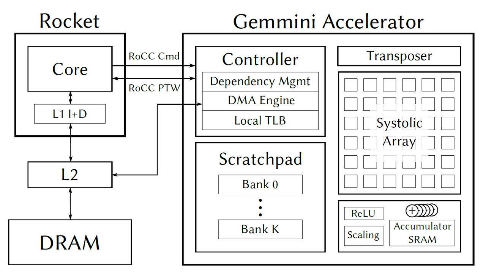

## Gemmini

The Gemmini project is developing a full-system, full-stack DNN hardware exploration and evaluation platform. Gemmini enables architects to make useful insights into how different components of the system and software stack (outside of just the accelerator itself) interact to affect overall DNN performance.

Gemmini is part of the [Chipyard](https://github.com/ucb-bar/chipyard) ecosystem, and was developed using the [Chisel](https://www.chisel-lang.org/) hardware description language. This document is intended to provide information for beginners who want to try Gemmini in [buddy-mlir](https://github.com/buddy-compiler/buddy-mlir) project.We present this document from the following aspects.

- Architecture of Gemmini
- Gemmini in chipyard
- Gemmini in buddy-mlir

### Architecture of Gemmini



Gemmini is implemented as a RoCC accelerator with non-standard RISC-V custom instructions. The Gemmini unit uses the RoCC port of a Rocket or BOOM *tile*, and by default connects to the memory system through the System Bus (i.e., directly to the L2 cache).

At the heart of the accelerator lies a systolic array which performs matrix multiplications. By default, the matrix multiplication support both *output-stationary* and *weight-stationary* dataflows, which programmers can pick between at runtime. However, the dataflow can also be hardened at elaboration time.

The systolic array's inputs and outputs are stored in an explicitly managed scratchpad, made up of banked SRAMs. A DMA engine facilitates the transfer of data between main memory (which is visible to the host CPU) and the scratchpad.

Because weight-stationary dataflows require an accumulator outside the systolic array, we add a final SRAM bank, equipped with adder units, which can be conceptually considered an extension of the scratchpad memory space. The systolic array can store results to any address in the accumulator, and can also read new inputs from any address in the accumulator. The DMA engine can also transfer data directly between the accumulator and main memory, which is often necessary to load in biases.

Gemmini also includes peripheral circuitry to optionally apply activation functions such as ReLU or ReLU6, scale results down by powers-of-2 to support quantized workloads, or to transpose matrices before feeding them into the systolic array to support the output-stationary dataflow.

**Details of architecture and ISA are presented in the** **[gemmini](https://github.com/ucb-bar/gemmini#architecture)** **project.**

### Gemmini in chipyard

#### Three repos

- [gemmini : Berkeley's Spatial Array Generator](https://github.com/ucb-bar/gemmini)

  - [gemmini-rocc-tests](https://github.com/ucb-bar/gemmini-rocc-tests) （submodule of gemmini）

     Fork of seldridge/rocket-rocc-examples with tests for a systolic array based matmul accelerator

  - [libgemmini : Gemmini extensions for Spike](https://github.com/ucb-bar/libgemmini) （submodule of gemmini）

      This repository builds libgemmini.so, which can be dynamically linked into Spike to support executing custom Gemmini instructions.

Because both `gemmini-rocc-tests` and `libgemmini` are submodules of gemmini, we take `gemmini` as the root directory. 

And in `scripts/build-spike.sh`, there is the following logic:

```shell
# scripts/build-spike.sh

cp software/gemmini-rocc-tests/include/gemmini_params.h software/libgemmini/gemmini_params.h
make -C software/libgemmini clean
make -C software/libgemmini install
```

This script ensures `libgemmini/gemmini_params.h` and `gemmini-rocc-tests/include/gemmini.h` always the same，and recompiles `libgemmini.so` which `spike` dependents on. So, we can just focus on repo `gemmini-rocc-tests`. There are two important header files in this repo:

- `gemmini.h`

  - This header is a C library which wraps the calls to the custom Gemmini instructions into common DNN operators like matmuls, convolutions (with or without pooling), matrix-additions, etc. Note that the DNN tests rely upon this C library of common DNN operators. They call very few direct Gemmini ISA instructions, and mostly call the wrappers around them found in the C library.

- `gemmini_params.h`

  - The Gemmini generator generates a C header file (`gemmini_params.h`) based on the generator parameters when we run `build-spike.sh`. This header files gets compiled together with the C library to tune library performance. 

    ```shell
    # scripts/build-spike.sh
    
    cd ../../sims/verilator/
    echo Generating new gemmini_params.h file...
    make verilog CONFIG=CustomGemminiSoCConfig &> build.log
    ```

#### Build Simulator & C Library

For `gemmini` project, the complete build logic should be as following:

1. Run `scripts/setup-paths.sh` script which complete the copy (symlink) of the configuration file, and now we have `configs` folder. A total of four configuration files will be copied to the new directory.

   1. `src/main/scala/gemmini/Configs.scala`
      1.    -> `configs/GemminiDefaultConfigs.scala`
   2. `src/main/scala/gemmini/CustomConfigs.scala`
      1.   -> `configs/GemminiCustomConfigs.scala`
   3. `src/main/scala/gemmini/CustomCPUConfigs.scala`
      1.   -> `configs/CPUConfigs.scala`
   4. `src/main/scala/gemmini/CustomSoCConfigs.scala`
      1.   -> `configs/SoCConfigs.scala`

   The corresponding script code is as follows. The command `sed '1,1d; $d'` is used to delete the comment tags at the beginning and end of the source file.

   ```shell
   if [ ! -f configs/GemminiDefaultConfigs.scala ]; then
       ln -s $PWD/src/main/scala/gemmini/Configs.scala configs/GemminiDefaultConfigs.scala
   fi
   
   if [ ! -f configs/GemminiCustomConfigs.scala ]; then
       ln -s $PWD/src/main/scala/gemmini/CustomConfigs.scala configs/GemminiCustomConfigs.scala
   fi
   
   if [ ! -f configs/CPUConfigs.scala ]; then
       sed '1,1d; $d' $PWD/src/main/scala/gemmini/CustomCPUConfigs.scala > ../chipyard/src/main/scala/config/GemminiCPUConfigs.scala
       ln -s $PWD/../chipyard/src/main/scala/config/GemminiCPUConfigs.scala configs/CPUConfigs.scala
   fi
   
   if [ ! -f configs/SoCConfigs.scala ]; then
       sed '1,1d; $d' $PWD/src/main/scala/gemmini/CustomSoCConfigs.scala > ../chipyard/src/main/scala/config/GemminiSoCConfigs.scala
       ln -s $PWD/../chipyard/src/main/scala/config/GemminiSoCConfigs.scala configs/SoCConfigs.scala
   fi
   ```

2. Run `scripts/build-verilator.sh` and `scripts/build-spike.sh`，Both of these scripts will ultimately land in the `../../sims/verilator` directory to execute the  `make`  command with the specified parameter `CONFIG=CustomGemminiSoCConfig`.

   ```shell
   # build-spike.sh
   
   cd ../../sims/verilator/
   echo Generating new gemmini_params.h file...
   make verilog CONFIG=CustomGemminiSoCConfig &> build.log
   
   cd -
   cp software/gemmini-rocc-tests/include/gemmini_params.h software/libgemmini/gemmini_params.h
   make -C software/libgemmini clean
   make -C software/libgemmini install
   
   # ----------------------------------------------------------------------------------
   
   # build-verilator.sh
   
   cd ../../sims/verilator/
   make -j$j ${debug} CONFIG=CustomGemminiSoCConfig
   ```

   The `CustomGemminiSoCConfig` mentioned here appears in the above configuration file `configs/SoCConfigs.scala`，Additionally, we notice the `help()` functions in both of these scripts:

   ```shell
   # build-verilator.sh
   help () {
     echo "Build a cycle-accurate Verilator simulator for RISCV Gemmini programs,"
     echo 'matching `customConfig` in `configs/GemminiCustomConfigs.scala`.'
     ......
   }
   
   # build-spike.sh
   help () {
     echo "Build a functional simulator for RISCV Gemmini programs, matching"
     echo '`customConfig` in `configs/GemminiCustomConfigs.scala`.'
     ......
   }
   ```

   They both indicate that during compilation, we are matching with the `customConfig` in `configs/GemminiCustomConfigs.scala`. When we need to modify the Gemmini configuration later, we should:

   1. Assign the new config to `customConfig`.
   2. Re-run `build-spike.sh` to take effect.

### Gemmini in buddy-mlir

[Buddy-mlir](https://github.com/buddy-compiler/buddy-mlir) is an MLIR-based compiler framework designed for a co-design ecosystem from DSL (domain-specific languages) to DSA (domain-specific architectures).

#### Gemmini Dialect

Gemmini dialect is a basic dialect to target RISC-V Gemmini extension.

##### Operation definitions

We define operation for `gemmini` dialect in file `midend/include/Dialect/Gemmini/Gemmini.td`.

- `flush`
- `config_st` , `config_ld` , `config_ex` , `config_norm`
- `mvin` , `mvin2` , `mvin3` , `mvout`
- `print`
- `preload_zeros` , `preload` , `compute_preloaded` , `compute_accumulated`
- `tile_matmul` , `tile_conv`

|    **Operator Name**    |                 **Description**                 |
| :---------------------: | :---------------------------------------------: |
|        **flush**        |      **Flush operation flushes the TLB.**       |
|      **config_st**      |           **Config store operation**            |
|      **config_ld**      |            **Config load operation**            |
|      **config_ex**      | **ConfigExOp configures the execute pipeline.** |
|     **config_norm**     | **ConfigNormOp configures normalized pipeline** |
|        **mvin**         |  **Move data from main memory to scratchpad**   |
|        **mvin2**        |  **Move data from main memory to scratchpad**   |
|        **mvin3**        |  **Move data from main memory to scratchpad**   |
|        **mvout**        |    **Move data from scratchpad to L2/DRAM**     |
|        **print**        |             **Print memref value.**             |
|    **preload_zeros**    |         **Preload zeros in scratchpad**         |
|       **preload**       |        **Preload matrix in scratchpad**         |
|  **compute_preloaded**  |            **Explicitly Preloaded**             |
| **compute_accumulated** |        **compute accumulated opertion**         |
|     **tile_matmul**     |       **Perform matrix multiplication.**        |
|      **tile_conv**      |            **Perform convolution.**             |

After the build, we can find the files generated by TableGen in the  `build/midend/include/Dialect/Gemmini/*` folder.

##### Intrinsic operation definitions

We define intrinsic operations for `gemmini` dialect in file `midend/include/Dialect/Gemmini/Gemmini.td`.

- `flush`
- `config_st` , `config_ld` , `config_ex` , `config_norm`
- `mvin` , `mvin2` , `mvin3` , `mvout`
- `preload` , `compute_preloaded` , `compute_accumulated`
- `loop_ws_config_bounds` , `loop_ws_config_addrs_ab` , `loop_ws_config_addrs_dc` , `loop_ws_config_strides_ab` , `loop_ws_config_strides_dc`
- `loop_ws` , `loop_conv_ws`
- `loop_conv_ws_config1` , `loop_conv_ws_config2` , `loop_conv_ws_config3` , `loop_conv_ws_config4` , `loop_conv_ws_config5` , `loop_conv_ws_config6`

The logic is in `midend/include/Dialect/Gemmini/CMakeLists.txt` 

```shell
add_mlir_dialect(Gemmini gemmini)
add_mlir_doc(Gemmini Gemmini Dialects/ -gen-dialect-doc)

set(LLVM_TARGET_DEFINITIONS Gemmini.td)
mlir_tablegen(GemminiConversions.inc -gen-llvmir-conversions)
add_public_tablegen_target(BuddyGemminiConversionsIncGen)
```

We use `tablegen` to generate the relevant files, and it also generates `GemminiConversions.inc`. This file guides the conversion of the preceding Intrinsic ops. Below is an example, refer to the complete code in file`build/midend/include/Dialect/Gemmini/GemminiConversions.inc`。

```c++
if (auto op = dyn_cast<::buddy::gemmini::ComputeAccumulated_IntrOp>(opInst)) {

    llvm::Module *module = builder.GetInsertBlock()->getModule();
    llvm::Function *fn = llvm::Intrinsic::getDeclaration(
        module,
        llvm::Intrinsic::riscv_compute_accumulated,
        { 
        });
    auto operands = moduleTranslation.lookupValues(opInst.getOperands());
    
    auto *inst = builder.CreateCall(fn, operands);
    (void) inst;
    
  return success();
}
```

It's clear that if `opInst` type is `::buddy::gemmini::ComputeAccumulated_IntrOp`，then we will try to replace it with `llvm::Intrinsic::riscv_compute_accumulated`. In fact，in file `backend/include/llvm/IR/IntrinsicsRISCVBuddyExt.td`，we have defined `RISC-V buddy extension`. After the build, we can find the extended RISC-V instruction set in `build/backend/include/llvm/IR/IntrinsicsRISCV.h`, which includes the custom instructions we defined earlier.

```c++
namespace llvm {
namespace Intrinsic {
enum RISCVIntrinsics : unsigned {
// Enum values for intrinsics
//  ......
    riscv_compute_accumulated,                 // llvm.riscv.compute.accumulated
    riscv_compute_preloaded,                   // llvm.riscv.compute.preloaded
    riscv_config_ex,                           // llvm.riscv.config.ex
    riscv_config_ld,                           // llvm.riscv.config.ld
    riscv_config_norm,                         // llvm.riscv.config.norm
    riscv_config_st,                           // llvm.riscv.config.st
    riscv_flush,                               // llvm.riscv.flush
    riscv_loop_conv_ws,                        // llvm.riscv.loop.conv.ws
    riscv_loop_conv_ws_config1,                // llvm.riscv.loop.conv.ws.config1
    riscv_loop_conv_ws_config2,                // llvm.riscv.loop.conv.ws.config2
    riscv_loop_conv_ws_config3,                // llvm.riscv.loop.conv.ws.config3
    riscv_loop_conv_ws_config4,                // llvm.riscv.loop.conv.ws.config4
    riscv_loop_conv_ws_config5,                // llvm.riscv.loop.conv.ws.config5
    riscv_loop_conv_ws_config6,                // llvm.riscv.loop.conv.ws.config6
    riscv_loop_ws,                             // llvm.riscv.loop.ws
    riscv_loop_ws_config_addrs_ab,             // llvm.riscv.loop.ws.config.addrs.ab
    riscv_loop_ws_config_addrs_dc,             // llvm.riscv.loop.ws.config.addrs.dc
    riscv_loop_ws_config_bounds,               // llvm.riscv.loop.ws.config.bounds
    riscv_loop_ws_config_strides_ab,           // llvm.riscv.loop.ws.config.strides.ab
    riscv_loop_ws_config_strides_dc,           // llvm.riscv.loop.ws.config.strides.dc
    // ......
    }; // enum
} // namespace Intrinsic
} // namespace llvm
```

#### Pass

##### Linalg Lowering

The main logic is in `midend/lib/Conversion/LowerLinalgToGemmini/LowerLinalgToGemmini.cpp`. This file defines the logic for lowering from the `linalg` dialect to the `gemmini` dialect.

It mainly includes the lowering of the following operators (due to gemmini's systolic array architecture, which is suitable for matrix multiplication, these common operators are lowered to gemmini):

- `linalg::MatmulOp - MatmulLowering`
  - Replaced using `gemmini::TileMatMulOp`.
- `linalg::Conv2DNchwFchwOp - Conv2DNchwFchwLowering`
  - Convert input from NCHW to NHWC, weights from FCHW to CHWF, and output from NCHW to NHWC.
  - Replaced using `gemmini::TileConvOp`.
- `linalg::Conv2DNhwcHwcfOp - Conv2DNhwcHwcfLowering`
  - Layout conversion.
  - Replaced using `gemmini::TileConvOp`.
- `linalg::BatchMatmulOp - BatchMatMulOpLowering`
  - Extract the batch dimension and iterate over `linalg::MatmulOp`.

You can find the specific implementations in the mentioned file. Details are not repeated here.

##### Gemmini Lowering

The main logic is in `midend/lib/Dialect/Gemmini/Transforms/LegalizeForLLVMExport.cpp`. This file defines the lowering logic for all `gemmini operations`, replacing `gemmini operations` with `gemmini intrinsic operations`. You can find the specific implementations in this file. Here, we focus on the last two functions:

- `configureGemminiLegalizeForExportTarget`
  - This function explains that after lowering, all `gemmini operations` are illegal, while `gemmini intrinsic operations` are legal. 
  - This indicates that after completing all lowerings, only `gemmini intrinsic operations` will remain, and `gemmini operations` will no longer appear.
- `populateGemminiLegalizeForLLVMExportPatterns`
* This function defines the patterns for lowering, adding all `gemmini operation` lowerings to the patterns.

```c++
void mlir::configureGemminiLegalizeForExportTarget(
    LLVMConversionTarget &target) {
  target.addLegalOp<
      Flush_IntrOp, ConfigSt_IntrOp, ConifgLd_IntrOp, ConfigEX_IntrOp,
      Mvin_IntrOp, Mvin2_IntrOp, Mvin3_IntrOp, Mvout_IntrOp, Preload_IntrOp, ComputePreloaded_IntrOp,
      ComputeAccumulated_IntrOp, LoopWsConfigBounds_IntrOp,
      LoopWsConfigAddrsAB_IntrOp, LoopWsConfigAddrsDC_IntrOp,
      LoopWsConfigStridesAB_IntrOp, LoopWsConfigStridesDC_IntrOp, LoopWs_IntrOp,
      LoopConvWsConfig1_IntrOp, LoopConvWsConfig2_IntrOp,
      LoopConvWsConfig3_IntrOp, LoopConvWsConfig4_IntrOp,
      LoopConvWsConfig5_IntrOp, LoopConvWsConfig6_IntrOp, LoopConvWs_IntrOp, ConfigNorm_IntrOp>();
  target.addIllegalOp<FlushOp, ConfigStOp, ConfigLdOp, ConfigExOp, MvinOp, Mvin2Op, Mvin3Op,
                      MvoutOp, PrintOp, PreloadZerosOp, PreloadOp,
                      ComputePreloadedOp, ComputeAccumulatedOp, TileMatMulOp,
                      TileConvOp, ConfigNormOp>();
}

void mlir::populateGemminiLegalizeForLLVMExportPatterns(
    LLVMTypeConverter &converter, RewritePatternSet &patterns, int64_t dim,
    int64_t addrLen, size_t sizeOfElemT, size_t sizeOfAccT) {
  patterns
      .add<ForwardOperands<func::CallOp>, ForwardOperands<func::CallIndirectOp>,
           ForwardOperands<func::ReturnOp>>(converter, &converter.getContext());
  patterns.add<GemminiFlushLowering>(converter);
  patterns.add<GemminiConfigStLowering>(converter);
  patterns.add<GemminiConfigLdLowering>(converter);
  patterns.add<GemminiMvinLowering>(converter, addrLen);
  patterns.add<GemminiMvin2Lowering>(converter, addrLen);
  patterns.add<GemminiMvin3Lowering>(converter, addrLen);
  patterns.add<GemminiMvoutLowering>(converter, addrLen);
  patterns.add<GemminiConfigExLowering>(converter);
  patterns.add<GemminiConfigNormLowering>(converter);
  patterns.add<GemminiPreloadZerosLowering>(converter, dim, addrLen);
  patterns.add<GemminiPreloadLowering>(converter, addrLen);
  patterns.add<GemminiComputePreloadedLowering>(converter, addrLen);
  patterns.add<GemminiComputeAccumulatedLowering>(converter, addrLen);
  patterns.add<GemminiTileMatMulLowering>(converter, dim, addrLen, sizeOfElemT,
                                          sizeOfAccT);
  patterns.add<GemminiTileConvLowering>(converter, dim, addrLen, sizeOfElemT,
                                        sizeOfAccT);
}
```

Meanwhile, we noticed that the preceding `print` does not have corresponding `lowering` functions, and there is no `runOnOperation` function in the above files. Finally, we found these missing parts in the `midend/lib/Conversion/LowerGemmini/LowerGemminiPass.cpp` file (**in fact, I believe these two files should be merged into one**).

```c++
void LowerGemminiToLLVMPass::runOnOperation() {
  MLIRContext *context = &getContext();
  ModuleOp module = getOperation();
  // The default elem_t is int8_t,
  // so the default size of elem_t is 1 type.
  size_t sizeOfElemT = sizeof(int8_t);
  if (elemType == "f32")
    sizeOfElemT = sizeof(float);
  // The default acc_t is int32_t,
  // so the default size of acc_t is 4 type.
  size_t sizeOfAccT = sizeof(int32_t);
  if (accType == "f32")
    sizeOfAccT = sizeof(float);
  LLVMTypeConverter converter(context);
  RewritePatternSet patterns(context);
  LLVMConversionTarget target(*context);
  configureGemminiLegalizeForExportTarget(target);
  populateGemminiLegalizeForLLVMExportPatterns(
      converter, patterns, dim, addrLen, sizeOfElemT, sizeOfAccT);
  populateAffineToStdConversionPatterns(patterns);
  populateSCFToControlFlowConversionPatterns(patterns);
  mlir::arith::populateArithToLLVMConversionPatterns(converter, patterns);
  populateFinalizeMemRefToLLVMConversionPatterns(converter, patterns);
  cf::populateControlFlowToLLVMConversionPatterns(converter, patterns);
  populateFuncToLLVMConversionPatterns(converter, patterns);
  patterns.add<PrintOpLowering>(&getContext());
  if (failed(applyPartialConversion(module, target, std::move(patterns))))
    signalPassFailure();
}
```

#### Translation

The main logic is in `midend/lib/Target/LLVMIR/Dialect/Gemmini/GemminiToLLVMIRTranslation.cpp`. This file implements the translation interface from the `Gemmini dialect` to `LLVM IR`. Since the code is minimal, we'll directly bring it over:

```c++
namespace {
/// Implementation of the dialect interface that converts operations belonging
/// to the Gemmini dialect to LLVM IR.
class GemminiDialectLLVMIRTranslationInterface
    : public LLVMTranslationDialectInterface {
public:
  using LLVMTranslationDialectInterface::LLVMTranslationDialectInterface;

  /// Translates the given operation to LLVM IR using the provided IR builder
  /// and saving the state in `moduleTranslation`.
  LogicalResult
  convertOperation(Operation *op, llvm::IRBuilderBase &builder,
                   LLVM::ModuleTranslation &moduleTranslation) const final {
    Operation &opInst = *op;
#include "Gemmini/GemminiConversions.inc"

    return failure();
  }
};
} // end namespace

void buddy::registerGemminiDialectTranslation(DialectRegistry &registry) {
  registry.insert<gemmini::GemminiDialect>();
  registry.addExtension(
      +[](MLIRContext *ctx, gemmini::GemminiDialect *dialect) {
        dialect->addInterfaces<GemminiDialectLLVMIRTranslationInterface>();
      });
}

void buddy::registerGemminiDialectTranslation(MLIRContext &context) {
  DialectRegistry registry;
  registerGemminiDialectTranslation(registry);
  context.appendDialectRegistry(registry);
}
```

We find that below are two `registration` functions, and the actual conversion logic is in the `convertOperation()` function. Here, we encounter a familiar figure:`Gemmini/GemminiConversions.inc`. As mentioned earlier, this file guides how to convert `gemmini intrinsic operations`. Interestingly, during gemmini lowering,`gemmini operations` are eliminated, but `gemmini intrinsic operaions` still exist. At this stage, we will completely transform them into `LLVM IR`.

#### Execution

There are three ways to interact with `gemmini dialect`. We demonstrate three typical examples below, you can find them in `examples/GemminiDialect/`:

- `performance-test.c `

  Invoking functions from `gemmini-rocc-tests/include/gemmini.h`. This directly calls the interfaces encapsulated by gemmini, and has nothing to do with MLIR.

  ```makefile
  c-matmul-32x32-gemmini-run:
      @riscv64-unknown-linux-gnu-gcc performance-test.c \
      -I${RISCV}/../../generators/gemmini/software/gemmini-rocc-tests/include \
      -I${RISCV}/../../generators/gemmini/software/gemmini-rocc-tests  \
      -DMATMUL=1 -O2 -static 
      @spike --extension=gemmini pk a.out 
  ```

- `performance-test.cpp `

  Writing interface functions through MLIR, lowering to generate a shared library, and then calling functions from the linked library in a CPP file.

  ```makefile
  linalg-matmul-32x32-cpu-run:
      @${BUDDY_OPT} ./ciface.mlir \
      -llvm-request-c-wrappers \
      -convert-linalg-to-loops \
      -lower-affine -convert-scf-to-cf \
      -convert-vector-to-llvm -finalize-memref-to-llvm \
      -convert-arith-to-llvm \
      -lower-gemmini \
      -convert-func-to-llvm -reconcile-unrealized-casts | \
      ${BUDDY_TRANSLATE} -buddy-to-llvmir | \
      ${BUDDY_LLC} -filetype=obj -mtriple=riscv64 \
          -mattr=+buddyext,+D -float-abi=hard \
          -o log.o 
      @riscv64-unknown-linux-gnu-g++ log.o -DMATMUL=1 \
      -DDIALECT=1 performance-test.cpp \
      -O2 -static -o a.out -I${INTERFACES} 
      @spike --extension=gemmini pk a.out
  ```

- `batch_matmul.mlir`

  Directly writing the `main` function using MLIR, without the need for interaction with C/C++ code.

  ```makefile
  gemmini-linalg-batch-matmul-run:
      @${BUDDY_OPT} ./batch_matmul.mlir \
          -convert-linalg-to-gemmini \
          -expand-strided-metadata\
          -convert-linalg-to-loops \
          -lower-gemmini | \
      ${BUDDY_TRANSLATE} -buddy-to-llvmir | \
      ${BUDDY_LLC} -filetype=obj -mtriple=riscv64 \
          -mattr=+buddyext,+D -float-abi=hard \
          -o log.o
      @riscv64-unknown-linux-gnu-gcc log.o -O2 -static -o a.out
      @spike --extension=gemmini pk a.out
  ```

  